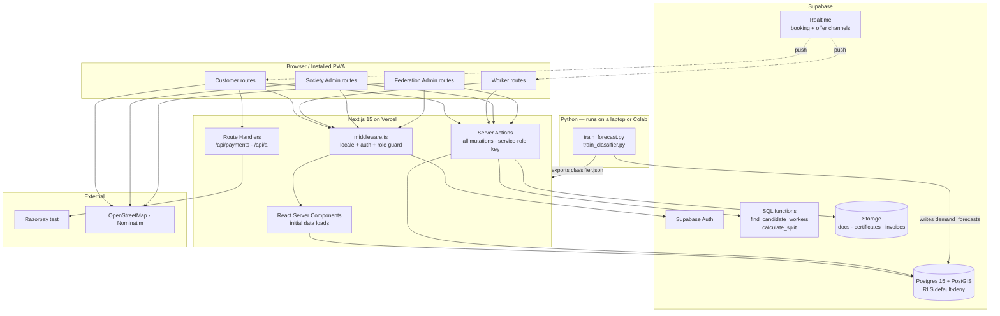
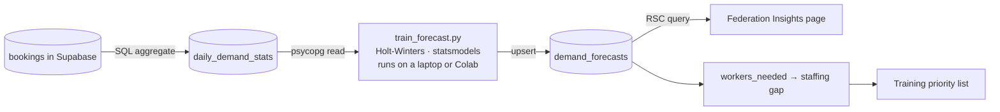
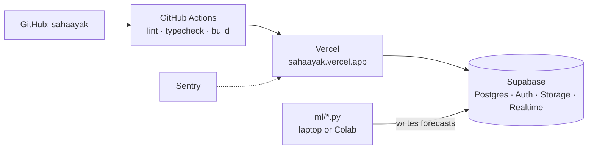

# SAHAAYAK — ARCHITECTURE v2
### Single Responsive Web App · Next.js + Supabase
**SIH 2026 · PS 26089 · Ministry of Cooperation / NCCT**

> **This document supersedes Sections 3, 9, 14, 15, 18, 19 and 20 of v1.**
> Everything else in v1 — the PRD, personas, user stories, functional and non-functional
> requirements, the **entire database schema**, the geo-matching logic, the AI models,
> the RBAC matrix, the multilingual strategy and the demo script — **carries over unchanged.**
>
> That the schema survived a complete stack change is not luck. It is the payoff of
> designing the data model before the framework, and it is worth saying out loud to judges.

---

## 1. THE DECISION

**Yes. Build it as one responsive Next.js web app on Supabase.**

For a 5–6 person student team on a hackathon clock, this is a materially better plan than v1. Here is the honest accounting.

### 1.1 What you gain

| | v1 (RN + FastAPI + Supabase) | v2 (Next.js + Supabase) |
|---|---|---|
| Repositories | 3 | **1** |
| Deployments | 3 (Expo, Render, Vercel) | **1** (Vercel) |
| Languages | Python + TypeScript | **TypeScript** |
| API contract to freeze and sync | Yes — a whole coordination tax | **No** — server actions are type-checked end to end |
| Auth to build | JWT, refresh, hashing, roles (~1 week) | **Supabase Auth** (~half a day) |
| File uploads | Adapter + signed URLs | **Supabase Storage** (built in) |
| Realtime booking status | Polling | **Supabase Realtime** (free, built in) |
| Cold starts | Render sleeps 15 min → 50 s wake | **None** — Vercel edge, always warm |
| Estimated build effort | 100% | **~60%** |

The cold-start elimination alone is worth it. The single most likely way your v1 demo failed on stage was a sleeping Render instance. That failure mode no longer exists.

The bigger win is subtler: **there is no API contract to freeze.** In v1, your week-1 gate was "agree the OpenAPI spec and don't change it," and your recurring integration risk was contract drift between three repos. In v2 a server action is a typed TypeScript function. Rename a field and the build breaks immediately, in your editor, not on stage.

### 1.2 What you give up — and what to do about it

**(a) The PS asks for a "Multilingual mobile application."** This is the one real cost, and you should not hand-wave it.

Mitigation, in order of effort:

1. **Ship it as an installable PWA** — `manifest.json`, service worker, app icon, standalone display mode, web push. On a judge's Android phone it installs to the home screen, opens without a browser chrome, and sends push notifications. It *is* a mobile application in every way a user experiences one. Cost: about half a day.
2. **Demo it on a phone, not a laptop.** Two phones on stage, exactly as in the v1 script. If it looks and behaves like an app on a phone, the question mostly doesn't get asked.
3. **Keep a Capacitor wrap in your back pocket.** `npx cap add android` around the same Next.js build produces a real APK, installable, Play-Store-shippable. Roughly one day of work. If you have slack in week 4, do it — then you can literally hand a judge an APK. If you don't, the PWA holds.

Say this if asked: *"It's a responsive PWA — installable, offline-capable, with push. The same codebase wraps to a native APK through Capacitor; we prioritised a complete working platform over two separately-maintained clients."* That is a defensible engineering answer, not an excuse.

**(b) The AI moves out of the request path.** Python doesn't run in a Next.js server action. Section 5 below solves this cleanly, and honestly the result is *better architecture* than v1 — forecasts belong in a table, not in a live model call.

**(c) Supabase lock-in.** Mild and reversible: Supabase is plain Postgres with an API in front. Your schema, your RLS policies and your SQL functions are all portable. Worst case you `pg_dump` and self-host.

**(d) Vercel serverless limits.** 10-second timeout on the free tier. Every operation you have is well under that (the matching query is sub-100 ms). Only forecast *training* would exceed it — which is exactly why it runs offline.

### 1.3 The one trap that will actually hurt you

**Row Level Security is not optional in this architecture.**

In v1, authorization lived in one place: a FastAPI dependency. In v2, if any component calls Supabase from the browser with the anon key, **RLS policies are your entire authorization layer.** Get a policy wrong and any logged-in user can read every worker's uploaded ID documents.

The rule that keeps you safe, and it is non-negotiable:

> **Default-deny RLS on every table. All writes and all sensitive reads go through Next.js server actions using the service-role key. The service-role key never leaves the server.**

Concretely:
- `NEXT_PUBLIC_SUPABASE_ANON_KEY` → browser, read-only, tightly scoped by RLS.
- `SUPABASE_SERVICE_ROLE_KEY` → server actions and route handlers only. **Never** prefixed `NEXT_PUBLIC_`. If it ever appears in a client component, it is compromised.
- Money splits, booking state transitions, verification decisions and matching **always** run server-side. The client never sends an amount you trust.

---

## 2. FINAL STACK — v2

```
FRAMEWORK     Next.js 15 (App Router) · React 19 · TypeScript
STYLING       TailwindCSS · shadcn/ui · CSS variables for theming
FORMS         react-hook-form + zod (zod schemas shared with server actions)
SERVER STATE  TanStack Query (client) + React Server Components (initial loads)
CLIENT STATE  Zustand — only for language, active booking, map draft
DATABASE      Supabase Postgres 15 + PostGIS
AUTH          Supabase Auth (email/password, phone-styled) + RLS
STORAGE       Supabase Storage — private buckets, signed URLs
REALTIME      Supabase Realtime — booking status, incoming offers
BUSINESS LOGIC Next.js Server Actions + Route Handlers
MATCHING      Postgres function (plpgsql) called via supabase.rpc()
AI            Python offline → writes forecasts to Postgres
              Classifier: trained in Python → weights exported → TS inference
MAPS          Leaflet + react-leaflet + OpenStreetMap + Nominatim
CHARTS        Recharts
i18n          next-intl (locale routing, server + client)
PWA           next-pwa (manifest, service worker, web push)
PDF           @react-pdf/renderer (invoices)
PAYMENTS      Razorpay test mode via Route Handler
DEPLOY        Vercel (app) + Supabase (data) — both free
CI            GitHub Actions (lint + typecheck + build)
ERRORS        Sentry free tier

TOTAL COST    ₹0
NUMBER OF DEPLOYS  1
COLD STARTS   0
```

### 2.1 Auth without paying for SMS

Supabase phone OTP requires a paid SMS provider (Twilio/MSG91). The clean workaround, and it costs nothing:

> **Use Supabase Auth email/password, but make the login field a phone number.** The app appends a fixed domain: the user types `9876543210`, you call `signInWithPassword({ email: '9876543210@sahaayak.app', password })`. The real phone number is also stored on the `profiles` row for display and future OTP.

The UX is a phone login. The plumbing is email auth. Phase 2 swaps `signInWithOtp({ phone })` in once an SMS provider is funded — the `profiles.phone` column is already populated, so nothing migrates.

Do not build your own JWT layer here. That was the right call in v1 because you already had a Python backend; it is wasted work now.

---

## 3. APPLICATION ARCHITECTURE



### 3.1 Route structure — one app, four experiences

```
app/
├── [locale]/                          # next-intl: /en /hi /pa
│   ├── (public)/
│   │   ├── page.tsx                   # landing — the cooperative story
│   │   └── login/  register/
│   ├── (customer)/
│   │   ├── home/                      # categories, search, AI box, SOS button
│   │   ├── services/[id]/             # detail + price breakup
│   │   ├── book/[serviceId]/          # address → slot → review → confirm
│   │   ├── bookings/                  # list
│   │   ├── bookings/[id]/             # live status (Realtime) + start-OTP + pay
│   │   └── profile/                   # addresses, language
│   ├── (worker)/
│   │   ├── dashboard/                 # online toggle, today, active job
│   │   ├── offers/                    # incoming offers (Realtime) + timer
│   │   ├── jobs/[id]/                 # en route → arrived → OTP → complete
│   │   ├── earnings/                  # per-job breakup, welfare total
│   │   └── profile/                   # skills, documents, radius
│   ├── (society)/
│   │   ├── overview/  verification/  workers/  workers/[id]/
│   │   ├── rates/                     # floor wage, commission %, welfare %
│   │   ├── bookings/  analytics/
│   └── (federation)/
│       ├── overview/  societies/  heatmap/
│       ├── insights/                  # AI panel
│       └── welfare/
├── api/
│   ├── payments/create-order/route.ts
│   ├── payments/verify/route.ts
│   ├── payments/webhook/route.ts
│   ├── ai/classify/route.ts
│   └── invoice/[bookingId]/route.ts   # streams the PDF
├── actions/                           # server actions, grouped by domain
│   ├── auth.ts     bookings.ts   offers.ts
│   ├── workers.ts  verification.ts  rates.ts
│   ├── ratings.ts  payments.ts   analytics.ts
└── middleware.ts                      # locale → session → role guard
```

**One codebase, four route groups, one deploy.** Compare to v1's three repos and three deploy pipelines. This is the whole argument for v2 in one directory tree.

### 3.2 Middleware: locale + auth + role in one pass

```ts
// middleware.ts
export async function middleware(req: NextRequest) {
  const res = intlMiddleware(req)                       // 1. resolve /en /hi /pa
  const supabase = createMiddlewareClient({ req, res })
  const { data: { session } } = await supabase.auth.getSession()

  const path = req.nextUrl.pathname
  const seg  = path.split('/')[2]                       // route group after locale
  const guarded = ['customer','worker','society','federation']
  if (!guarded.includes(seg)) return res
  if (!session) return NextResponse.redirect(new URL('/login', req.url))

  const role = session.user.app_metadata.role as Role    // set at signup, in the JWT
  const allowed: Record<string, Role[]> = {
    customer:   ['CUSTOMER'],
    worker:     ['WORKER'],
    society:    ['SOCIETY_ADMIN', 'FEDERATION_ADMIN'],
    federation: ['FEDERATION_ADMIN', 'SUPER_ADMIN'],
  }
  if (!allowed[seg].includes(role))
    return NextResponse.redirect(new URL('/unauthorized', req.url))

  return res
}
```

Storing `role` in `app_metadata` puts it inside the JWT, which means **both** the middleware and your RLS policies read it without an extra query. That is the single detail that makes RBAC cheap in this stack.

### 3.3 Server actions replace the REST API

The v1 endpoint list maps one-to-one. Same logic, no HTTP layer, full type safety:

| v1 REST endpoint | v2 server action |
|---|---|
| `POST /bookings` | `createBooking(input)` |
| `POST /bookings/emergency` | `createEmergencyBooking(input)` |
| `POST /offers/{id}/accept` | `acceptOffer(offerId)` |
| `POST /bookings/{id}/start` | `startJob(bookingId, otp)` |
| `POST /bookings/{id}/complete` | `completeJob(bookingId, materialsCost)` |
| `POST /society/workers/{id}/verify` | `verifyWorker(workerId, decision, reason)` |
| `PUT /society/rates/{serviceId}` | `updateRateCard(serviceId, rates)` |
| `POST /ratings` | `submitRating(input)` |
| `GET /ai/forecast` | direct RSC query on `demand_forecasts` |

Payments stay as **Route Handlers**, not server actions — Razorpay's webhook needs a real URL, and signature verification wants raw body access.

```ts
// app/actions/bookings.ts
'use server'
export async function createEmergencyBooking(input: EmergencyBookingInput) {
  const parsed = emergencyBookingSchema.parse(input)      // zod — same schema as the form
  const { user } = await requireRole('CUSTOMER')          // throws → redirect
  const db = createServiceClient()                        // service-role, server only

  const rate = await getRateCard(parsed.serviceId, parsed.societyId)
  const pricing = calculatePricing(rate, { isEmergency: true })   // server-side. always.

  const { data: booking } = await db.from('bookings').insert({
    customer_id: user.id,
    service_id: parsed.serviceId,
    address_id: parsed.addressId,
    society_id: parsed.societyId,
    is_emergency: true,
    status: 'REQUESTED',
    quoted_price_paise: pricing.total,
    rate_snapshot: rate,
    start_otp: generateOtp(),
    booking_code: await nextBookingCode(),
  }).select().single()

  await dispatchOffers(booking, { parallel: 5, radiusM: 15000, timerSec: 30 })
  revalidatePath('/bookings')
  return { bookingId: booking.id, pricing }
}
```

Note `calculatePricing` runs on the server against the stored rate card. The client's idea of the price is never trusted — that is NFR-15 and the money-integrity rule from v1, preserved exactly.

---

## 4. THE MATCHING ENGINE MOVES INTO POSTGRES

In v1 the geo query ran in SQL and the fairness scoring ran in Python. In v2 **both run in one Postgres function** called via `supabase.rpc()`. This is faster (one round trip, no rows shipped to be re-sorted) and it keeps the logic in one auditable place.

```sql
create or replace function find_candidate_workers(
  p_lat            double precision,
  p_lng            double precision,
  p_skill_id       uuid,
  p_society_ids    uuid[],
  p_radius_m       integer default 10000,
  p_is_emergency   boolean default false,
  p_limit          integer default 10
)
returns table (
  worker_id uuid, user_id uuid, full_name text, photo_url text,
  distance_m integer, rating_avg numeric, jobs_last_7d integer,
  match_score numeric, score_breakdown jsonb
)
language plpgsql
stable
security definer
as $$
declare
  v_point      geography := st_setsrid(st_makepoint(p_lng, p_lat), 4326)::geography;
  v_avg_jobs   numeric;
  -- weight profiles: emergency prioritises proximity, scheduled prioritises fairness
  w_prox  numeric := case when p_is_emergency then 0.60 else 0.35 end;
  w_skill numeric := case when p_is_emergency then 0.10 else 0.25 end;
  w_fair  numeric := case when p_is_emergency then 0.10 else 0.20 end;
  w_qual  numeric := case when p_is_emergency then 0.10 else 0.15 end;
  w_rel   numeric := case when p_is_emergency then 0.10 else 0.05 end;
begin
  select coalesce(nullif(avg(jobs_last_7d), 0), 1)
    into v_avg_jobs
    from workers
   where society_id = any(p_society_ids)
     and verification_status = 'VERIFIED';

  return query
  with candidates as (
    select
      w.id, w.user_id, p.full_name, p.photo_url,
      st_distance(w.base_location, v_point)::integer as dist_m,
      w.rating_avg, w.total_ratings, w.jobs_last_7d, w.acceptance_rate,
      ws.society_certified, ws.years_experience
    from workers w
    join worker_skills ws on ws.worker_id = w.id and ws.skill_id = p_skill_id
    join profiles p       on p.id = w.user_id
    where w.verification_status = 'VERIFIED'
      and w.is_available = true
      and w.deleted_at is null
      and w.society_id = any(p_society_ids)
      and st_dwithin(w.base_location, v_point, p_radius_m)          -- GIST index
      and st_distance(w.base_location, v_point) <= w.service_radius_km * 1000
  ),
  scored as (
    select c.*,
      greatest(0, 1 - (c.dist_m::numeric / p_radius_m))                    as s_prox,
      (0.6 * c.society_certified::int
         + 0.4 * least(c.years_experience::numeric / 10, 1))               as s_skill,
      -- FAIRNESS: fewer recent jobs than the society average scores higher
      (1 - least(c.jobs_last_7d::numeric / v_avg_jobs, 1))                 as s_fair,
      -- new workers get a neutral 0.7, not a zero — no cold-start lockout
      (case when c.total_ratings >= 3 then c.rating_avg / 5.0 else 0.7 end) as s_qual,
      c.acceptance_rate                                                     as s_rel
    from candidates c
  )
  select
    s.id, s.user_id, s.full_name, s.photo_url, s.dist_m,
    s.rating_avg, s.jobs_last_7d,
    round(w_prox*s.s_prox + w_skill*s.s_skill + w_fair*s.s_fair
        + w_qual*s.s_qual + w_rel*s.s_rel, 4) as match_score,
    jsonb_build_object(
      'proximity',   round(s.s_prox, 3),
      'skill',       round(s.s_skill, 3),
      'fairness',    round(s.s_fair, 3),
      'quality',     round(s.s_qual, 3),
      'reliability', round(s.s_rel, 3),
      'weights',     jsonb_build_object('proximity', w_prox, 'skill', w_skill,
                                        'fairness', w_fair, 'quality', w_qual,
                                        'reliability', w_rel),
      'jobs_last_7d', s.jobs_last_7d,
      'society_avg_jobs_7d', round(v_avg_jobs, 2)
    ) as score_breakdown
  from scored s
  order by match_score desc
  limit p_limit;
end;
$$;
```

Called from a server action in one line:

```ts
const { data: candidates } = await db.rpc('find_candidate_workers', {
  p_lat: address.lat, p_lng: address.lng,
  p_skill_id: service.required_skill_id,
  p_society_ids: eligibleSocietyIds,
  p_radius_m: isEmergency ? 15000 : 10000,
  p_is_emergency: isEmergency,
  p_limit: isEmergency ? 5 : 3,
})
```

**Keep storing `score_breakdown` on every `booking_offers` row.** It is still the single strongest thing in your demo: open any booking in the Society dashboard and show the judge the exact numbers that chose worker A over worker B, including `jobs_last_7d` versus the society average. No private aggregator will show you that.

---

## 5. THE AI LAYER WITHOUT A PYTHON SERVER

Python doesn't run in a Next.js server action, so the AI has to be rearranged. The result is genuinely better architecture, not a compromise — forecasts belong in a table that the dashboard reads instantly, not in a live model call that can time out on stage.

### 5.1 Demand forecasting — offline training, table-backed serving



The script is ~80 lines: connect to Supabase Postgres over the connection string, read `daily_demand_stats`, fit `ExponentialSmoothing` per (society, service) series, upsert into `demand_forecasts` with `model_version` and the MAPE. Run it with `python ml/train_forecast.py`.

**This preserves the best demo beat in the whole pitch.** A judge asks whether the AI is real: you alt-tab to a terminal, run the script, it prints per-series MAPE, you refresh the dashboard and the chart updates. That is *more* convincing than an API call, because they watch the model train.

Automate it in Phase 2 with a GitHub Actions cron (free) that runs the script nightly and writes to Supabase. No server needed, ever.

### 5.2 Request classifier — trained in Python, inference in TypeScript

A TF-IDF + LinearSVC classifier is, at inference time, a sparse dot product. So train it in Python and **export the weights as JSON**; do the ~40 lines of inference in TypeScript inside a route handler.

```python
# ml/export_classifier.py
import json, joblib
vec, clf = joblib.load('classifier.joblib')
json.dump({
    'vocabulary': {k: int(v) for k, v in vec.vocabulary_.items()},
    'idf':        vec.idf_.tolist(),
    'coef':       clf.coef_.tolist(),
    'intercept':  clf.intercept_.tolist(),
    'classes':    clf.classes_.tolist(),
    'analyzer':   'char_wb', 'ngram_range': [3, 5],
}, open('../lib/ai/classifier.json', 'w'))
```

```ts
// lib/ai/classify.ts  — pure TS, no model runtime, ~2 ms
import model from './classifier.json'

export function classifyRequest(text: string) {
  const vec = tfidfVectorize(text.toLowerCase(), model)      // char 3-5 grams
  const scores = model.coef.map((row, i) =>
    row.reduce((sum, w, j) => sum + w * (vec[j] ?? 0), 0) + model.intercept[i])
  const best = scores.indexOf(Math.max(...scores))
  const confidence = softmax(scores)[best]
  return confidence < 0.45
    ? { serviceId: null, suggestions: topN(scores, model.classes, 3) }
    : { serviceId: model.classes[best], confidence }
}
```

Trained in Python on your ~800 Hindi/English/Hinglish phrase dataset, shipped as a ~1 MB JSON, inferred at the edge with zero cold start and zero dependencies. Character n-grams matter here: they survive transliteration and spelling variation, which is exactly what "pankha nahi chal raha" versus "पंखा नहीं चल रहा" requires.

### 5.3 If you'd rather keep a Python service

Perfectly valid alternative: a ~150-line FastAPI on **Hugging Face Spaces** (Docker, free, and — unlike Render — does not sleep) exposing `/forecast` and `/classify`, called from Next.js route handlers.

Take this path only if someone on the team strongly prefers keeping Python in the request path. It adds a second deploy and a network hop for no capability you don't already have. **My recommendation is the offline-training path in 5.1 and 5.2.**

---

## 6. ROW LEVEL SECURITY — THE PART YOU CANNOT SKIP

RLS is now your authorization layer. The v1 RBAC matrix is unchanged; only the enforcement mechanism moves. Write these policies in **week 1**, not week 4.

### 6.1 The pattern

```sql
-- 1. Default deny on everything.
alter table workers            enable row level security;
alter table worker_documents   enable row level security;
alter table bookings           enable row level security;
alter table booking_offers     enable row level security;
alter table payment_splits     enable row level security;
alter table payments           enable row level security;
-- ... every single table

-- 2. Helper functions reading role/scope straight out of the JWT
create or replace function auth_role() returns text
language sql stable as $$
  select coalesce(auth.jwt() -> 'app_metadata' ->> 'role', 'ANON');
$$;

create or replace function auth_society_id() returns uuid
language sql stable as $$
  select nullif(auth.jwt() -> 'app_metadata' ->> 'society_id', '')::uuid;
$$;
```

### 6.2 Key policies

```sql
-- A customer sees only their own bookings; a worker sees only bookings assigned to them
create policy bookings_select_own on bookings for select using (
     customer_id = auth.uid()
  or worker_id in (select id from workers where user_id = auth.uid())
  or (auth_role() = 'SOCIETY_ADMIN'    and society_id = auth_society_id())
  or (auth_role() = 'FEDERATION_ADMIN' and society_id in (
        select id from societies where federation_id = auth_federation_id()))
);

-- Nobody writes a booking from the browser. Ever. Server actions only.
create policy bookings_no_client_write on bookings for all to authenticated
  using (false) with check (false);

-- Worker documents: the owner and their own society admin. Nobody else.
create policy worker_documents_select on worker_documents for select using (
     worker_id in (select id from workers where user_id = auth.uid())
  or (auth_role() = 'SOCIETY_ADMIN' and worker_id in (
        select id from workers where society_id = auth_society_id()))
);

-- Payment splits are read-only, to the two parties and their society
create policy payment_splits_select on payment_splits for select using (
  payment_id in (
    select p.id from payments p join bookings b on b.id = p.booking_id
    where b.customer_id = auth.uid()
       or b.worker_id in (select id from workers where user_id = auth.uid())
       or (auth_role() = 'SOCIETY_ADMIN' and b.society_id = auth_society_id())
  )
);
```

Storage buckets need the same treatment: make `worker-documents` **private**, and serve every file through a server-generated signed URL with a 5-minute expiry. A public bucket containing scanned ID documents is the worst outcome available to this project, and it is one checkbox away.

### 6.3 Testing RLS — a 30-minute task that saves the project

Write one integration test per role that logs in as that role and attempts to read a row it must not see, asserting an empty result. Six tests. Run them in CI. This is the cheapest insurance in the entire build.

---

## 7. WHAT REPLACES THE MOBILE APP EXPERIENCE

### 7.1 Responsive strategy

Build **mobile-first**, because customers and workers are on phones and only admins are on desktop.

| Breakpoint | Who | Layout |
|---|---|---|
| `< 640px` | Customer + worker (primary) | Single column, bottom tab bar, full-width cards, sticky CTA |
| `640–1024px` | Tablet, society admin | Two columns, collapsible sidebar |
| `> 1024px` | Society + federation dashboards | Sidebar + data tables + charts |

Customer and worker routes render a **bottom tab bar** on small screens — identical to the v1 app navigation. Admin routes render a **sidebar** and are not optimised below 640px, which is fine because nobody verifies documents on a phone.

### 7.2 PWA setup

```ts
// next.config.ts
import withPWA from 'next-pwa'
export default withPWA({
  dest: 'public',
  register: true,
  skipWaiting: true,
  disable: process.env.NODE_ENV === 'development',
})({ /* next config */ })
```

```json
// public/manifest.json
{
  "name": "Sahaayak — Cooperative Services",
  "short_name": "Sahaayak",
  "start_url": "/hi/home",
  "display": "standalone",
  "background_color": "#FFFFFF",
  "theme_color": "#1B7A43",
  "orientation": "portrait",
  "icons": [
    { "src": "/icon-192.png", "sizes": "192x192", "type": "image/png" },
    { "src": "/icon-512.png", "sizes": "512x512", "type": "image/png" }
  ]
}
```

Checklist: manifest linked in the root layout · maskable icons at 192 and 512 · `display: standalone` · offline fallback page · `theme_color` matching the brand · Web Push via the service worker (Android Chrome, and iOS 16.4+ once installed) · Lighthouse PWA audit passing before the finale.

### 7.3 Realtime replaces push polling

Supabase Realtime is free and removes a whole category of work from v1:

```ts
// worker offers — arrives instantly, no polling, no push service
useEffect(() => {
  const ch = supabase.channel(`offers:${workerId}`)
    .on('postgres_changes',
      { event: 'INSERT', schema: 'public', table: 'booking_offers',
        filter: `worker_id=eq.${workerId}` },
      ({ new: offer }) => { setOffer(offer); playSound(); vibrate() })
    .subscribe()
  return () => { supabase.removeChannel(ch) }
}, [workerId])
```

`vibrate()` plus a sound on an installed PWA reproduces the demo moment from v1 exactly: **the worker's phone buzzes on stage when the customer books.** That beat survives intact, and it is the one you must not lose.

---

## 8. DEPLOYMENT — SIMPLER STILL



| Component | Service | Free tier |
|---|---|---|
| Entire app | Vercel Hobby | 100 GB bandwidth, unlimited deploys, **no cold starts** |
| Database + Auth + Storage + Realtime | Supabase Free | 500 MB DB, 1 GB storage, 200 concurrent realtime, 50k MAU |
| CI | GitHub Actions | 2,000 min/mo |
| Errors | Sentry | 5k events/mo |
| ML | Local Python or Colab | Free |

```bash
# .env.local
NEXT_PUBLIC_SUPABASE_URL=https://xxx.supabase.co
NEXT_PUBLIC_SUPABASE_ANON_KEY=eyJ...          # browser-safe, RLS-constrained
SUPABASE_SERVICE_ROLE_KEY=eyJ...              # SERVER ONLY — never NEXT_PUBLIC_
RAZORPAY_KEY_ID=rzp_test_...
RAZORPAY_KEY_SECRET=...
NEXT_PUBLIC_RAZORPAY_KEY_ID=rzp_test_...      # public key id only
DATABASE_URL=postgresql://...                  # for the Python ML scripts
NEXT_PUBLIC_APP_URL=https://sahaayak.vercel.app
```

**One deploy. No Docker. No Render. No Expo build. No cold start.** Every operational risk in the v1 risk register that involved a sleeping backend is now gone.

Phase 2/3 evolution: Vercel Pro and Supabase Pro when traffic warrants it, connection pooling via Supavisor, a GitHub Actions cron for nightly forecasts, and — when a single Next.js app genuinely becomes the bottleneck — extract the matching and AI logic to a dedicated service. The SQL functions and the schema move unchanged; that is why they live in Postgres rather than in application code.

---

## 9. REVISED TEAM PLAN (5–6 PEOPLE, ONE CODEBASE)

One repo changes the coordination problem. Nobody is blocked on an API contract, but everybody is now in each other's files — so ownership must be by **route group**, and shared code needs one owner.

| # | Role | Owns | Deliverables |
|---|---|---|---|
| 1 | **Tech Lead / Data** | Schema, migrations, RLS, SQL functions, auth, shared `lib/` | Supabase project, full schema, RLS policies, `find_candidate_workers`, auth + middleware, seed data |
| 2 | **Customer flows** | `(customer)/*` + booking server actions | Home, discovery, address+map, booking, live status, payment, rating |
| 3 | **Worker flows** | `(worker)/*` + offer/job server actions | Registration, documents, offers with Realtime, job lifecycle, earnings, welfare |
| 4 | **Admin dashboards** | `(society)/*` + `(federation)/*` | Verification queue, worker registry, rate card, analytics, heatmap, insights |
| 5 | **AI / Analytics** | `ml/*`, `daily_demand_stats`, insights data | Forecast script, classifier + TS export, seed data generator, staffing + training-priority logic |
| 6 | **Design system / i18n / PWA** | `components/ui/*`, `messages/*`, PWA, polish | shadcn theming, `PriceBreakupCard`, `WorkerCard`, `OfferCard`, 3 locales, manifest + service worker, responsive QA |

At 5 people, fold role 6 into roles 2 and 4, and give the design system to whoever is strongest on CSS.

**Rules for a shared repo:**
1. **Own your route group.** Cross-group edits go through a PR to the owner.
2. **`lib/` and `components/ui/` belong to roles 1 and 6.** Nobody else edits them without asking — this is where merge conflicts come from.
3. **Server actions live in `app/actions/`, grouped by domain, never inline in a page.** Otherwise Phase 3 extraction becomes impossible and testing becomes impossible sooner.
4. **zod schemas are shared between the form and the action.** One definition, validated on both sides.
5. **Feature branches, small PRs, merge daily.** With one repo, a branch that lives three days is a merge conflict with your teammates' work.

### Revised timeline

**Week 1 — Foundation.** Supabase project · full schema + PostGIS · **RLS policies** · seed data · Supabase Auth with the phone-styled login · middleware with locale and role guards · shadcn theme · route group shells for all four roles.
*Gate: all four roles log in and land on their own shell, deployed on Vercel.*

**Week 2 — Core loop.** Worker registration + document upload · society verification queue · `find_candidate_workers` function · booking creation · offer dispatch with Realtime · accept/reject.
*Gate: a booking is created and a worker accepts it, live.*

**Week 3 — Money, dashboards, AI.** Job lifecycle with start-OTP · Razorpay · split + welfare ledger · invoice PDF · earnings · ratings · both dashboards · forecast script + insights page.
*Gate: the full journey runs end to end on the deployed app.*

**Week 4 — Polish.** Three locales · responsive QA at 360px · PWA install + push · empty states and error handling · seed data realism · **ten full demo rehearsals** · backups.

---

## 10. REVISED MVP CHECKLIST

### MUST BUILD

- [ ] Supabase project, full v1 schema, PostGIS enabled, Alembic-equivalent migrations in `supabase/migrations/`
- [ ] **RLS default-deny + policies for all six roles, with tests**
- [ ] Supabase Auth, phone-styled login, `role` in `app_metadata`
- [ ] Middleware: locale + session + role guard
- [ ] Seed data: 1 federation, 3 societies, 40 workers, 8 months of bookings
- [ ] Service catalogue + per-society rate cards
- [ ] Worker registration + document upload to a **private** bucket
- [ ] Society verification queue with signed-URL document viewer, approve/reject, audit row
- [ ] Address picker (Leaflet + Nominatim), saved addresses
- [ ] Scheduled booking + **emergency booking**
- [ ] **`find_candidate_workers` SQL function with fairness scoring + stored `score_breakdown`**
- [ ] Offer dispatch, expiry timer, accept/reject, first-accept-wins
- [ ] **Realtime offer delivery to the worker (buzz + sound)**
- [ ] Job lifecycle: en route → arrived → start-OTP → complete
- [ ] Razorpay test payment + signature verification (Route Handler)
- [ ] **Split calculation server-side → `payment_splits` + `welfare_contributions`**
- [ ] Worker earnings + welfare screens
- [ ] Ratings
- [ ] Society dashboard: overview, verification, workers, rates, bookings, analytics
- [ ] Federation dashboard: overview, societies, heatmap, **insights**
- [ ] **Forecast script → `demand_forecasts` → staffing gap → training priorities**
- [ ] 3 locales via next-intl
- [ ] Responsive down to 360px + bottom tabs on mobile
- [ ] **PWA installable with a working manifest**
- [ ] Deployed on Vercel

### SHOULD BUILD IF TIME PERMITS
Classifier (Python-trained → TS inference) · invoice PDF · web push · demand heatmap · manual allocation for unfulfilled bookings · insurance status card · MAPE shown beside the forecast · Capacitor APK wrap.

### CAN MOCK
OTP (mock code on screen) · DigiLocker eKYC screen · e-Shram insurance connector · worker GPS movement · booking history (synthetic but seasonally realistic).

### DO NOT START
Everything in v1 §20.4 and §20.5.

---

## 11. RISK REGISTER — WHAT CHANGED

| Risk | v1 | v2 |
|---|---|---|
| Backend cold start kills the demo | **High / Critical** | **Eliminated** |
| API contract drift across repos | High / High | **Eliminated** |
| Expo build fails before the finale | Medium / High | **Eliminated** |
| Three deploys out of sync | Medium / High | **Eliminated** |
| **RLS misconfigured → data leak** | n/a | **New: High / Critical** — write policies in week 1, test in CI |
| **Service-role key leaks to the client** | n/a | **New: Medium / Critical** — never prefix it `NEXT_PUBLIC_`; grep the bundle before the finale |
| Judges question the missing native app | Low | **Medium / Medium** — PWA install demo + the Capacitor answer |
| Supabase free DB pauses after 7 idle days | Medium / High | Unchanged — log in weekly, keep a `pg_dump` |
| Venue Wi-Fi fails | Medium / Critical | Unchanged — hotspot, recorded video, local `supabase start` |
| Scope creep in week 3 | High / High | Unchanged — hard freeze, Blockers only |

Net: **four critical risks removed, two new ones introduced, and both new ones are fixed by a week-1 task.** That is a good trade.

---

## 12. FINAL DECISION — v2

> **One Next.js 15 App Router project, mobile-first responsive, installable as a PWA, serving customer, worker, society-admin and federation-admin experiences as four route groups. Supabase provides Postgres+PostGIS, Auth, Storage and Realtime. All mutations run in server actions with the service-role key; RLS is default-deny as defence in depth. Geo-matching and fairness scoring live in a single Postgres function. AI models train offline in Python and write to tables the app reads. Razorpay test mode via route handlers. Deployed on Vercel. One repo, one deploy, zero cold starts, ₹0.**

**Carried over from v1, unchanged:** the entire PRD · the database schema · the fairness-ranking weights and rationale · the geo-matching approach · the three AI models · the RBAC matrix · the multilingual strategy · the privacy rules · the 8-minute demo script.

**The three things that must still be excellent:**
1. **Emergency booking** — request to acceptance, live, on two phones, under 30 seconds. Realtime makes this *easier* than v1.
2. **The payment split card** — the screen that makes the cooperative model visible.
3. **The Federation insights page** — forecast, staffing gap, training priorities.

### Build order — start here

```
1.  create-next-app + TypeScript + Tailwind + shadcn
2.  Supabase project · PostGIS · full schema · migrations committed
3.  RLS: default-deny + policies + role tests
4.  Auth: signup/login, role in app_metadata, middleware guards
5.  next-intl: 3 locales, [locale] routing
6.  Route group shells for all four roles + bottom tabs / sidebar
7.  Seed data generator (40 workers, 8 months of bookings)
8.  Catalogue + rate cards
9.  Worker registration + document upload (private bucket)
10. Society verification queue + signed URLs + audit
11. Address picker (Leaflet + Nominatim)
12. find_candidate_workers() SQL function + tests
13. Booking creation + offer dispatch + Realtime delivery
14. Accept/reject + assignment + revoke
15. Job lifecycle + start-OTP
16. Razorpay route handlers + split + welfare ledger
17. Earnings + welfare screens
18. Ratings
19. Society dashboard
20. Federation dashboard
21. Forecast script → demand_forecasts → insights page
22. Classifier (if time) · invoice PDF · web push
23. i18n pass · responsive QA at 360px · PWA · rehearse
```

Steps 1–17 are the product. Steps 18–23 are what wins the round.

---

*Sahaayak Architecture v2.0 — supersedes v1 §3, §9, §14, §15, §18, §19, §20.
All other v1 sections remain authoritative.*
