# SAHAAYAK
### A Cooperative-Owned Gig Services Platform for Household & Community Services
**Smart India Hackathon 2026 — PS ID 26089**
Ministry of Cooperation · National Council for Cooperative Training (NCCT)
Theme: Agriculture, FoodTech & Rural Development · Category: Software

**Document type:** Product Requirements Document + Technical Architecture Blueprint
**Version:** 1.0
**Audience:** Sahaayak build team (5–6 members)

---

## TABLE OF CONTENTS

1. [Executive Product Vision](#1-executive-product-vision)
2. [Phase 1 vs Phase 2 vs Phase 3 Overview](#2-phase-1-vs-phase-2-vs-phase-3-overview)
3. [Final Recommended Technology Stack](#3-final-recommended-technology-stack)
4. [Phase 1 MVP Scope](#4-phase-1-mvp-scope)
5. [Product Requirements Document](#5-product-requirements-document)
6. [Phase-Wise Feature Roadmap](#6-phase-wise-feature-roadmap)
7. [User Flows](#7-user-flows)
8. [User Roles and RBAC Matrix](#8-user-roles-and-rbac-matrix)
9. [Complete System Architecture](#9-complete-system-architecture)
10. [Technology Stack — Full Evaluation](#10-technology-stack--full-evaluation)
11. [Database Design](#11-database-design)
12. [Geo-Spatial Architecture](#12-geo-spatial-architecture)
13. [AI Architecture](#13-ai-architecture)
14. [API Design](#14-api-design)
15. [Frontend Information Architecture](#15-frontend-information-architecture)
16. [Multilingual Strategy](#16-multilingual-strategy)
17. [Security and Privacy](#17-security-and-privacy)
18. [Deployment Architecture](#18-deployment-architecture)
19. [Team Development Plan](#19-team-development-plan)
20. [Hackathon MVP Plan](#20-hackathon-mvp-plan)
21. [SIH Demo Strategy](#21-sih-demo-strategy)
22. [FINAL ARCHITECTURE DECISION](#22-final-architecture-decision)

---

# 1. EXECUTIVE PRODUCT VISION

## 1.1 What Sahaayak is

Sahaayak is a **cooperative-owned digital marketplace** for household and community services. It gives Labour Cooperative Federations and their member Societies the same technology leverage that private aggregators have — booking, geo-matching, digital payments, ratings, analytics — but with the ownership, wage policy, and welfare rules set by the cooperative instead of a private platform.

In one sentence: **the same convenience as a private services app, with the economics inverted so value flows back to the worker's own society.**

## 1.2 The problem being solved

Labour Cooperative Societies already hold the two things that are hardest to build — a **verified pool of skilled workers** and **deep local presence**. What they lack is the thin layer of software that turns those assets into steady demand.

The consequences today:

| Stakeholder | Current pain |
|---|---|
| Cooperative worker | Idle days despite skill; income depends on word-of-mouth; no formal record of work; no bargaining power on rates |
| Household / institution | No trusted way to find a verified plumber, caregiver or electrician locally; safety concerns; opaque pricing |
| Cooperative Society | Cannot see demand, cannot allocate its own workers efficiently, loses members to private aggregators |
| Federation / NCCT | No data on the cooperative labour economy; no lever to direct skill training where demand actually exists |
| The worker on a private app | Commission of 20–30%, algorithmically-driven allocation, no wage floor, welfare treated as an optional add-on |

## 1.3 Target users

- **Primary demand side:** urban and semi-urban households, plus institutions (schools, PHCs, cooperative offices, small businesses) needing recurring or on-demand services.
- **Primary supply side:** skilled and semi-skilled members of Labour Cooperative Societies — electricians, plumbers, carpenters, painters, domestic helpers, caregivers, drivers, gardeners, cleaners, technicians.
- **Operators:** Society Administrators (verify workers, set local rates, resolve grievances) and Federation Administrators (oversee multiple societies, view analytics, plan training).

## 1.4 Core value proposition

**For customers:** "A verified worker, from a registered cooperative, at a published price, at your door."
**For workers:** "More jobs, a fair floor wage, and insurance that funds itself from every job you do."
**For cooperatives:** "Your own platform — your members, your rates, your commission, your data."

## 1.5 What makes Sahaayak different from private gig platforms

| Dimension | Private aggregator | Sahaayak |
|---|---|---|
| Ownership | Private company / investors | Cooperative federation and its societies |
| Commission | 20–30%, flows out of the local economy | Society-set, transparent, flows back to the society |
| Wage setting | Platform-determined, dynamic | Floor wage set by the Society; visible in the price breakup |
| Verification | Self-onboarding + light background check | Physical verification by the worker's own Society + digital eKYC |
| Job allocation | Optimised for conversion; top-rated workers capture most jobs | **Fairness-aware rotation** — utilisation is an explicit ranking input |
| Welfare | Optional insurance the worker buys | **Automatic per-job welfare contribution** inside the payment split |
| Data | Owned by the platform | Owned by the federation; feeds public skill-training policy |
| Grievance | Support ticket to a call centre | Escalates to the Society the worker actually belongs to |

## 1.6 How the cooperative model creates value

The cooperative structure is not a constraint we work around — it is the source of three genuine technical and social advantages:

1. **Verification is cheap and credible.** A Society already knows its members personally. That converts the single hardest trust problem in a services marketplace into a workflow the Society is already performing offline.
2. **The commission stays local.** Because the Society is the platform owner, the take-rate is a cooperative surplus rather than an extraction. This lets Sahaayak run at a lower customer price *and* a higher worker payout than a private app on the same transaction.
3. **Welfare becomes structural.** With the society in the payment path, a small welfare percentage can be deducted and pooled automatically — something a private platform has no incentive to do and no clean mechanism for.

---

# 2. PHASE 1 vs PHASE 2 vs PHASE 3 OVERVIEW

| | **Phase 1 — Hackathon MVP** | **Phase 2 — Product Expansion** | **Phase 3 — Scalable Ecosystem** |
|---|---|---|---|
| **Goal** | One complete, polished end-to-end journey | Real integrations + genuine intelligence | Multi-state production platform |
| **Timeline** | SIH build window (~4–6 weeks prep + 36h finale) | 3–6 months post-SIH | 6–18 months |
| **Users** | Demo data: 1 federation, 2 societies, ~40 workers | 1 district pilot, real workers | Multiple states, many federations |
| **Architecture** | Modular monolith (FastAPI) + Postgres/PostGIS | Same monolith + background workers + cache | Monolith + extracted high-load services |
| **Auth** | JWT, mock OTP | Real SMS OTP, DigiLocker eKYC | SSO for federations, full audit |
| **Payments** | Razorpay **test mode**, split computed and shown | Razorpay live + Route split settlement | Reconciliation, payouts, escrow, GST invoices |
| **Geo** | PostGIS radius + straight-line distance | OSRM road distance + ETA, service-area polygons | Live tracking, zone optimisation |
| **AI** | Intent classifier + baseline demand forecast + fair-match scoring | LightGBM forecasting, no-show risk, review sentiment | OR-Tools workforce optimisation, MLOps |
| **Languages** | 3 (EN, HI, +1 regional) via i18n JSON | 8–10 via Bhashini + voice input | 22 scheduled languages, IVR/WhatsApp |
| **Deploy** | Vercel + Render + Supabase (all free) | Paid small tier, Redis, workers, staging | Kubernetes/managed containers, multi-region |
| **What judges see** | A real working product | — | — |

**The rule that governs every decision below:** Phase 1 must be *complete and working*, not *broad and broken*. Every Phase 2/3 feature must slot into the Phase 1 architecture without a rewrite — which is why the data model, the API surface, and the module boundaries below are already designed for Phase 3, even though only Phase 1 code gets written now.

---

# 3. FINAL RECOMMENDED TECHNOLOGY STACK

Full reasoning and alternatives are in [Section 10](#10-technology-stack--full-evaluation). This is the decision.

| Layer | Choice | Free? | Why |
|---|---|---|---|
| **Mobile app** (customer + worker) | **React Native + Expo (SDK 51+), TypeScript** | Yes | One codebase, runs on judges' phones via Expo Go, shares TS types with web |
| **Web dashboard** (society + federation admin) | **React 18 + Vite + TypeScript + TailwindCSS + shadcn/ui** | Yes | Fastest build loop, no SSR needed for an authenticated dashboard |
| **Charts** | **Recharts** | Yes | Declarative, tiny learning curve |
| **Maps** | **Leaflet + OpenStreetMap** (web), **react-native-maps** (mobile) | Yes | No API key, no billing account, no quota |
| **Backend** | **FastAPI (Python 3.11), modular monolith** | Yes | Same language as the AI layer; auto Swagger docs; async |
| **ORM / migrations** | **SQLAlchemy 2.0 + Alembic + GeoAlchemy2** | Yes | Migrations from day one = no Phase 2 rewrite |
| **Database** | **PostgreSQL 15 + PostGIS**, hosted on **Supabase free tier** | Yes | Relational integrity + native geo-queries in one engine |
| **Auth** | **Own JWT in FastAPI** (access + refresh), argon2 hashing, pluggable OTP provider | Yes | Portable, no vendor lock, no paid SMS in Phase 1 |
| **File storage** | **Supabase Storage** (worker docs, certificates, job photos) | Yes, 1 GB | Signed URLs, same project as the DB |
| **AI/ML** | **scikit-learn, statsmodels, pandas, joblib** | Yes | CPU-only, trains in seconds, ships as `.joblib` inside the API |
| **Payments** | **Razorpay Test Mode** (UPI/card sandbox) | Yes | Real gateway UX, zero cost, zero KYC needed for the demo |
| **PDF invoices** | **WeasyPrint** or **ReportLab** | Yes | Server-side PDF, stored in Supabase Storage |
| **Notifications** | **Expo Push** + in-app feed; **Brevo** for email | Yes | Push works in Expo Go; SMS mocked in Phase 1 |
| **i18n** | **i18next / react-i18next / expo-localization** | Yes | JSON locale files, no service dependency |
| **Frontend hosting** | **Vercel** (dashboard) | Yes | Git push → deploy |
| **Backend hosting** | **Render** free web service + **UptimeRobot** keep-alive | Yes | Docker or native Python; free tier sleeps, ping keeps it warm |
| **CI/CD** | **GitHub Actions** | Yes | Lint + tests + auto deploy |
| **Error tracking** | **Sentry** free tier | Yes | Optional but cheap insurance during the demo |
| **Design** | **Figma** free | Yes | Shared component library for both apps |

**One-line summary of the stack:**
> React Native (Expo) + React/Vite dashboard → FastAPI modular monolith → PostgreSQL/PostGIS on Supabase, with scikit-learn models served in-process, Razorpay test mode for payments, and Leaflet/OSM for maps. Everything free.

---

# 4. PHASE 1 MVP SCOPE

## 4.1 The one sentence Phase 1 must prove

> "A household in a district books a verified cooperative worker in under 60 seconds; the nearest fairly-selected worker accepts; the job completes with an OTP; payment splits automatically into worker wage, society commission and a welfare contribution; and the Federation dashboard shows the demand forecast that tells the society where to deploy workers next week."

If that sentence runs flawlessly on stage, the MVP has succeeded — regardless of what else is missing.

## 4.2 Phase 1 scope — IN

**Customer app (React Native)**
- Phone-based signup/login (mock OTP), language selection
- Home with service categories; search
- Address with map pin (Leaflet/OSM), saved addresses
- Service detail with transparent price breakup
- Booking: schedule a slot **or** emergency "Book Now"
- Live booking status; worker card with photo, society badge, rating, distance
- Start-OTP at service start, completion, payment (Razorpay test), invoice download
- Rate + review the worker
- Booking history

**Worker app (same React Native codebase, role-switched)**
- Login, profile with skills and society-verified badge
- Online/offline availability toggle
- Incoming job offer card with accept/reject and a 60-second timer
- Job lifecycle: accepted → on the way → OTP verify → in progress → completed
- Earnings screen: per-job breakup, welfare contributed to date, insurance status
- Ratings received

**Society Admin dashboard (React web)**
- Worker registry; verification queue (view documents → approve/reject)
- Skill and certification tagging
- Local rate card: floor wage, customer price, commission %, welfare %
- Live bookings board and grievance list
- Society analytics: bookings, revenue split, worker utilisation

**Federation Admin dashboard (React web)**
- Multi-society overview, comparison, worker/booking totals
- Demand heatmap on a map
- **AI panel:** 7-day demand forecast per service + "workers needed" staffing recommendation + skill-training priority list
- Welfare pool summary

**Cross-cutting**
- 3 languages (English, Hindi, one regional) across both apps
- Seeded demo data: 1 federation, 2–3 societies, 30–40 workers, 8 months of synthetic bookings
- Deployed and publicly reachable (not localhost)

## 4.3 Phase 1 scope — SIMULATED (and honestly labelled as such in the demo)

| Simulated item | How | Why it is acceptable |
|---|---|---|
| SMS OTP | Fixed dev OTP shown on screen | Real SMS requires a paid gateway; the flow is real |
| Aadhaar / DigiLocker eKYC | Mock verification screen returning a signed stub response | Sandbox access needs an entity registration; the workflow and DB fields are real |
| Payment settlement | Razorpay **test mode** captures the payment; split is computed, stored and displayed | Live split settlement needs a registered merchant |
| e-Shram / PMSBY insurance | Mock connector writes a policy record and shows coverage status | Real API needs government onboarding; the welfare ledger is real |
| Worker GPS movement | Simulated position updates during "on the way" | Removes demo-day dependence on real phones moving |
| Booking history for AI | Synthetic but realistically seasonal generated data | No cold-start; forecast charts look genuine and are genuinely computed |

**Demo integrity rule:** every simulated component is a real interface with a mock implementation behind it. Say this to the judges explicitly — "this is a mock adapter behind a real interface; swapping in the live API is a config change." That is a strength, not a weakness.

## 4.4 Phase 1 scope — OUT (deliberately)

Chat/calling between customer and worker · subscriptions and recurring bookings · referral and loyalty · worker training LMS · advanced fraud detection · offline-first sync · WhatsApp/IVR booking · real-time GPS tracking on a live map · multi-currency · web app for customers (mobile only) · admin mobile app.


---

# 5. PRODUCT REQUIREMENTS DOCUMENT

## 5.1 Problem statement

Labour Cooperative Federations and Societies hold large pools of skilled workers — electricians, plumbers, carpenters, painters, domestic helpers, caregivers, drivers, gardeners, cleaners and technicians — but have no structured digital platform to connect them with households and institutions. Private aggregators dominate this market, capturing high commissions and leaving cooperative workers underutilised despite verified skills and strong local presence. There is no cooperative-owned marketplace that guarantees fair wages, integrates worker welfare, and gives federations visibility into the labour economy they administer.

## 5.2 Product vision

To become the default digital infrastructure of the cooperative labour movement in India — where every Labour Cooperative Society can run a trusted, fairly-priced local services business from a phone, and every cooperative worker's job automatically builds their income record, their reputation, and their social security.

## 5.3 Goals

**Product goals**
- G1: Complete customer journey (discover → book → served → pay → rate) in under 60 seconds for an emergency booking.
- G2: Every worker on the platform carries a society-verified badge backed by stored, reviewable documents.
- G3: Every payment produces a transparent, itemised split visible to both customer and worker.
- G4: Every completed job contributes a welfare amount to the worker's welfare ledger, automatically.
- G5: Job allocation is measurably fairer than rating-only allocation (target: Gini coefficient of job distribution < 0.30 within a society).
- G6: Federations can see, per service and per area, what demand will look like next week.

**Hackathon goals**
- H1: A live, deployed, publicly reachable product — not a slide deck or a localhost demo.
- H2: A demo that shows all four roles in one continuous story in under 8 minutes.
- H3: Every one of the 11 Expected Solution Features in the PS is visibly addressed — built or credibly staged.

## 5.4 Non-goals

- Not building a general-purpose gig platform for any labour; scope is cooperative-registered workers only.
- Not replacing the Society's offline governance — Sahaayak digitises verification, it does not automate the decision.
- Not a training/LMS platform in Phase 1 (recommendation only, delivery in Phase 3).
- Not a social network; no worker-to-worker feed, no public profiles beyond booking context.
- Not building our own payment rails or wallet; we integrate a gateway.
- Not attempting real-time GPS tracking in Phase 1.

## 5.5 Target users

| Segment | Description | Size signal |
|---|---|---|
| Urban/semi-urban households | Need recurring (cleaning, domestic help) and episodic (plumbing, electrical) services | The mass demand base |
| Institutions | Schools, PHCs, cooperative offices, small businesses needing maintenance contracts | Higher-value, recurring |
| Cooperative workers | Verified members of Labour Cooperative Societies | The supply base |
| Society Administrators | 1–3 staff per Society managing members and rates | Operational users |
| Federation Administrators | State/district federation officials, NCCT | Policy and analytics users |

## 5.6 User personas

**Persona 1 — Meena Sharma, 38, Customer (Shimla)**
Working professional, two children, elderly mother at home. Needs a plumber today and a reliable caregiver twice a week. Has been burned by an unverified worker found through a shop board. *Wants:* someone verifiable, priced up front, who arrives when promised. *Fears:* strangers in the house, price surprises. *Tech:* Android, comfortable with UPI, prefers Hindi UI.

**Persona 2 — Ramesh Kumar, 45, Worker — Electrician (member, Shimla Labour Cooperative Society)**
15 years of experience, ITI certificate, works 12–15 days a month, the rest idle. Income varies wildly. No insurance. *Wants:* steady jobs near home, payment the same day, proof of his work history. *Fears:* travelling far for a small job, being rated unfairly, hidden deductions. *Tech:* Android, low data, Hindi only, uses WhatsApp heavily.

**Persona 3 — Anita Devi, 34, Worker — Caregiver**
Trained in elder care, works part-time within a 5 km radius because of school timings. *Wants:* jobs that fit fixed windows, safety, and a record of certification. *Fears:* being sent to unvetted addresses.

**Persona 4 — Suresh Patil, 50, Society Administrator**
Runs a Society of ~200 members with two staff and a register book. *Wants:* to know who is working, who is idle, what the Society earned, and to be able to verify a new member in minutes. *Fears:* software he cannot operate; losing the register's authority.

**Persona 5 — Dr. Kavita Rao, 47, Federation Administrator (NCCT-linked)**
Oversees 25 societies across a state. Reports on employment generation and plans skill-training budgets. *Wants:* comparable, exportable numbers and evidence for where to run training next quarter. *Fears:* data she cannot trust or explain upward.

## 5.7 User roles

| Role | Code | Description |
|---|---|---|
| Customer | `CUSTOMER` | Books services for a household or institution |
| Worker | `WORKER` | Verified member of a Society who delivers services |
| Society Admin | `SOCIETY_ADMIN` | Manages workers, verification, rates, grievances for one Society |
| Federation Admin | `FEDERATION_ADMIN` | Oversees all Societies under one Federation; analytics and policy |
| Super Admin | `SUPER_ADMIN` | Platform operator; manages federations, service catalogue, system config |
| *(Phase 2)* Verifier | `VERIFIER` | Delegated document-verification-only role inside a Society |
| *(Phase 3)* Institution Manager | `INSTITUTION` | Books and manages contracts on behalf of an organisation |

## 5.8 User stories

**Customer**
- C1: As a customer, I want to choose my language on first launch so I can use the app comfortably. *(P1)*
- C2: As a customer, I want to see service categories with clear prices so I know the cost before booking. *(P1)*
- C3: As a customer, I want to set my address on a map so the right nearby worker is assigned. *(P1)*
- C4: As a customer, I want to schedule a service for a chosen date and time slot. *(P1)*
- C5: As a customer, I want an emergency "Book Now" option that finds the nearest available worker immediately. *(P1)*
- C6: As a customer, I want to see the assigned worker's photo, skills, rating and cooperative society badge so I feel safe. *(P1)*
- C7: As a customer, I want to give the worker a start-OTP so no one can mark a job started falsely. *(P1)*
- C8: As a customer, I want to pay by UPI and receive an itemised invoice. *(P1)*
- C9: As a customer, I want to see how much of my payment goes to the worker, the society and welfare. *(P1)*
- C10: As a customer, I want to rate and review a completed service. *(P1)*
- C11: As a customer, I want to rebook a worker I liked. *(P2)*
- C12: As a customer, I want a recurring weekly booking for domestic help. *(P2)*
- C13: As a customer, I want to raise a complaint that goes to the worker's Society. *(P2)*

**Worker**
- W1: As a worker, I want to register through my Society and upload my ID and skill certificates. *(P1)*
- W2: As a worker, I want a verified badge once my Society approves me. *(P1)*
- W3: As a worker, I want to go online/offline so I only get offers when I am available. *(P1)*
- W4: As a worker, I want to see job offers with distance, pay and time, and accept or reject within a timer. *(P1)*
- W5: As a worker, I want jobs to be distributed fairly, not always to the highest-rated worker. *(P1)*
- W6: As a worker, I want to see my exact earnings per job with all deductions itemised. *(P1)*
- W7: As a worker, I want to see my welfare contributions accumulating and my insurance status. *(P1)*
- W8: As a worker, I want to set weekly availability windows. *(P2)*
- W9: As a worker, I want navigation to the customer's address. *(P2)*
- W10: As a worker, I want same-day payout to my bank/UPI. *(P2)*
- W11: As a worker, I want to be told which skill to train in next to earn more. *(P2)*

**Society Admin**
- S1: As a Society Admin, I want a queue of pending worker verifications with their documents. *(P1)*
- S2: As a Society Admin, I want to approve or reject with a reason, recorded in an audit trail. *(P1)*
- S3: As a Society Admin, I want to tag verified skills and certifications on a worker. *(P1)*
- S4: As a Society Admin, I want to set the floor wage, customer price, commission % and welfare % for my area. *(P1)*
- S5: As a Society Admin, I want a live board of today's bookings and their status. *(P1)*
- S6: As a Society Admin, I want to see worker utilisation so I can spot idle members. *(P1)*
- S7: As a Society Admin, I want to resolve grievances raised against or by my members. *(P2)*
- S8: As a Society Admin, I want to bulk-import my existing member register. *(P2)*

**Federation Admin**
- F1: As a Federation Admin, I want a comparative dashboard across all my Societies. *(P1)*
- F2: As a Federation Admin, I want a demand heatmap by area and service. *(P1)*
- F3: As a Federation Admin, I want a 7-day demand forecast with a recommended worker count per service. *(P1)*
- F4: As a Federation Admin, I want a ranked list of skills to prioritise for training. *(P1)*
- F5: As a Federation Admin, I want the total welfare pool and coverage rate. *(P1)*
- F6: As a Federation Admin, I want to export reports as CSV/PDF for government reporting. *(P2)*

## 5.9 Functional requirements

| ID | Requirement | Phase |
|---|---|---|
| FR-1 | Phone-based registration and login with OTP, role-aware, JWT session | 1 |
| FR-2 | Multilingual UI switchable at runtime, minimum 3 languages | 1 |
| FR-3 | Worker self-registration bound to a Society, with document upload | 1 |
| FR-4 | Society verification workflow: pending → under review → verified/rejected, with audit trail | 1 |
| FR-5 | Worker skill profile with skills, proficiency and society-certified flag | 1 |
| FR-6 | Service catalogue: category → service, with per-society rate cards | 1 |
| FR-7 | Customer address book with geo-coordinates set from a map | 1 |
| FR-8 | Scheduled booking with date and time slot | 1 |
| FR-9 | Emergency/on-demand booking with immediate matching | 1 |
| FR-10 | Geo-spatial matching: workers within radius, available, skill-matched, ranked | 1 |
| FR-11 | Fairness-aware ranking including recent-utilisation as an explicit factor | 1 |
| FR-12 | Offer dispatch to top-N workers with expiry timer; first accept wins | 1 |
| FR-13 | Booking state machine with full status history | 1 |
| FR-14 | Start-OTP verification at the customer's door | 1 |
| FR-15 | Payment initiation, capture and status tracking through a gateway | 1 |
| FR-16 | Automatic payment split: worker wage / society commission / welfare / platform | 1 |
| FR-17 | PDF invoice generation and download | 1 |
| FR-18 | Two-way rating and review after completion | 1 |
| FR-19 | Worker earnings ledger with per-job breakup and totals | 1 |
| FR-20 | Welfare ledger per worker and insurance policy status view | 1 |
| FR-21 | Society dashboard: workers, verification, rates, bookings, analytics | 1 |
| FR-22 | Federation dashboard: multi-society analytics, heatmap, welfare pool | 1 |
| FR-23 | AI: natural-language/voice service request → service category classification | 1 |
| FR-24 | AI: 7-day demand forecast per society × service with staffing recommendation | 1 |
| FR-25 | AI: skill-training priority ranking derived from unmet/forecast demand | 1 |
| FR-26 | Push and in-app notifications for booking lifecycle events | 1 |
| FR-27 | Real SMS OTP via gateway | 2 |
| FR-28 | DigiLocker/Aadhaar eKYC integration for worker identity | 2 |
| FR-29 | Live payment settlement and split payouts to worker and society | 2 |
| FR-30 | Recurring/subscription bookings | 2 |
| FR-31 | Grievance and dispute resolution workflow | 2 |
| FR-32 | Road-distance and ETA-based matching | 2 |
| FR-33 | Worker availability calendar and leave | 2 |
| FR-34 | Review sentiment analysis and quality alerts | 2 |
| FR-35 | e-Shram / PMSBY / PMJJBY live integration | 2 |
| FR-36 | WhatsApp and IVR booking channel | 2 |
| FR-37 | Voice input in Indian languages via Bhashini | 2 |
| FR-38 | Multi-federation, multi-state tenancy with data isolation | 3 |
| FR-39 | Optimisation-based workforce allocation across societies | 3 |
| FR-40 | ONDC network participation | 3 |
| FR-41 | Institution accounts with contracts and consolidated billing | 3 |
| FR-42 | Worker training marketplace and certification issuance | 3 |

## 5.10 Non-functional requirements

| ID | Category | Requirement | Phase |
|---|---|---|---|
| NFR-1 | Performance | Worker-matching query returns in < 500 ms for 10,000 workers | 1 |
| NFR-2 | Performance | API p95 latency < 800 ms on free-tier hosting | 1 |
| NFR-3 | Availability | Backend reachable during demo; keep-alive ping every 10 min | 1 |
| NFR-4 | Usability | Emergency booking completable in ≤ 4 taps | 1 |
| NFR-5 | Accessibility | Minimum 16sp text, 48dp touch targets, WCAG AA contrast, icon+text labels for low-literacy users | 1 |
| NFR-6 | Security | Passwords argon2-hashed; JWT with short-lived access + refresh; HTTPS everywhere | 1 |
| NFR-7 | Security | Worker documents in private storage, served only via short-lived signed URLs | 1 |
| NFR-8 | Privacy | Exact customer address revealed to the worker only after acceptance | 1 |
| NFR-9 | Privacy | Worker phone masked from the customer until the job starts | 2 |
| NFR-10 | Maintainability | Modular monolith with strict module boundaries; no cross-module DB access | 1 |
| NFR-11 | Maintainability | All schema changes via Alembic migrations; no manual SQL in production | 1 |
| NFR-12 | Portability | All third-party services behind an adapter interface (payments, SMS, KYC, insurance) | 1 |
| NFR-13 | Scalability | Stateless API so horizontal scaling needs no code change | 1 |
| NFR-14 | Observability | Structured JSON logs + request IDs; Sentry for errors | 1 |
| NFR-15 | Data integrity | Money stored as integer paise, never float | 1 |
| NFR-16 | Auditability | Every verification, rate change and payment split is immutably logged | 1 |
| NFR-17 | Localisation | No hardcoded user-facing strings; all through i18n keys | 1 |
| NFR-18 | Scalability | Support 100k workers, 1M bookings/month | 3 |
| NFR-19 | Compliance | DPDP Act 2023 alignment — consent, purpose limitation, erasure | 2 |
| NFR-20 | Resilience | Graceful degradation if the AI service is down (fall back to rules) | 1 |

## 5.11 Success metrics

**Phase 1 / hackathon metrics**
- End-to-end demo completes without a failure, in < 8 minutes.
- All 11 PS "Expected Solution Features" demonstrably addressed.
- Emergency booking: request → worker accepted in < 30 seconds on stage.
- Forecast chart renders from a genuinely trained model, not hardcoded values.

**Product metrics (Phase 2+)**
| Metric | Definition | Target |
|---|---|---|
| Worker utilisation | Active days ÷ available days | +40% vs pre-platform baseline |
| Job distribution fairness | Gini coefficient of jobs per worker within a society | < 0.30 |
| Worker take-home share | Worker payout ÷ customer price | ≥ 75% (vs ~70–80% on private apps *before* their surge/incentive games) |
| Welfare coverage | Workers with an active policy ÷ total verified workers | > 90% |
| Booking fulfilment rate | Accepted ÷ requested | > 85% |
| Emergency response time | Request → acceptance | < 90 s median |
| Customer repeat rate | Customers with ≥ 2 bookings in 90 days | > 40% |
| Verification turnaround | Submission → society decision | < 48 h |
| CSAT | Average rating | > 4.3 / 5 |

## 5.12 Assumptions

- A1: Societies will perform physical verification; Sahaayak digitises the record and decision, not the judgement.
- A2: Workers own an Android smartphone with intermittent data; the app must be light and tolerant of poor networks.
- A3: UPI is the dominant payment method for our customers.
- A4: Federations can mandate a standard rate-card structure while letting societies set local values.
- A5: For the hackathon, synthetic-but-realistic seed data is acceptable to judges when clearly labelled.
- A6: Government integrations (DigiLocker, e-Shram) are available at pilot stage through official onboarding.
- A7: Customers accept a slightly slower match in exchange for a verified cooperative worker.

## 5.13 Constraints

- **Cost:** ₹0 budget. Every component must be free or free-tier.
- **Time:** SIH preparation window plus a 36-hour finale; a 5–6 member student team.
- **Skill:** the team is student-level; the stack must be learnable, not exotic.
- **Free-tier limits:** Supabase 500 MB DB / 1 GB storage; Render free instances sleep after 15 min idle; Vercel bandwidth caps.
- **Regulatory:** real payment settlement, Aadhaar eKYC and e-Shram writes all require entity registration — out of reach for a student team, hence mocked behind real interfaces.
- **Connectivity:** the demo venue's network may be unreliable — the app must work on mobile data and have an offline fallback path for the demo.
- **Language coverage:** professional translation is unavailable; Phase 1 ships 3 carefully-checked languages rather than 10 machine-translated ones.

---

# 6. PHASE-WISE FEATURE ROADMAP

**Legend for the last column:** `BUILD` = write real code now · `MOCK` = real interface, fake implementation · `P2`/`P3` = later phase.
**Complexity:** S = under a day · M = 1–3 days · L = 4+ days (per developer).

## 6.1 Phase 1 — Hackathon MVP

| # | Feature | Description | Priority | Complexity | Build/Mock |
|---|---|---|---|---|---|
| 1 | Auth & roles | Phone + OTP login, JWT, 5 roles, role-based routing | P0 | M | **BUILD** (OTP mocked) |
| 2 | Language selection | 3 languages, runtime switch, persisted | P0 | S | **BUILD** |
| 3 | Service catalogue | Categories, services, icons, per-society rate cards | P0 | M | **BUILD** |
| 4 | Customer address + map pin | Leaflet/OSM picker, saved addresses, geocode | P0 | M | **BUILD** |
| 5 | Worker registration | Society selection, profile, skills, doc upload | P0 | M | **BUILD** |
| 6 | Verification workflow | Society reviews docs, approves/rejects, audit trail, badge | P0 | M | **BUILD** |
| 7 | Skill profiling | Skills + proficiency + society-certified flag + certificate file | P0 | S | **BUILD** |
| 8 | Scheduled booking | Date, slot, address, notes, price preview | P0 | M | **BUILD** |
| 9 | Emergency booking | "Book Now", widened radius, parallel offers, 60 s timer | P0 | M | **BUILD** |
| 10 | Geo matching | PostGIS radius query + availability + skill filter | P0 | M | **BUILD** |
| 11 | Fair-match ranking | Weighted score incl. utilisation fairness; explainable | P0 | M | **BUILD** |
| 12 | Offer dispatch | Top-N offers, expiry, first-accept-wins, reassignment | P0 | M | **BUILD** |
| 13 | Booking state machine | 9 states + full status history | P0 | M | **BUILD** |
| 14 | Start-OTP | 4-digit code the customer gives the worker to start | P1 | S | **BUILD** |
| 15 | Payments | Razorpay test order → checkout → webhook/verify → captured | P0 | M | **BUILD** (test mode) |
| 16 | Payment split | Worker / society / welfare / platform, stored + displayed | P0 | S | **BUILD** |
| 17 | Invoice PDF | Server-generated, stored, downloadable | P1 | M | **BUILD** |
| 18 | Ratings & reviews | 5-star + tags + comment; aggregates on the worker | P0 | S | **BUILD** |
| 19 | Worker earnings | Per-job breakup, daily/weekly/monthly totals | P0 | M | **BUILD** |
| 20 | Welfare ledger | Auto contribution per job, running pool, coverage status | P0 | M | **BUILD** |
| 21 | Insurance status card | Scheme, policy number, validity, coverage amount | P1 | S | **MOCK** connector |
| 22 | Push notifications | Expo Push for offer/accept/complete/payment events | P1 | M | **BUILD** |
| 23 | Society dashboard | Workers, verification queue, rates, live bookings, analytics | P0 | L | **BUILD** |
| 24 | Federation dashboard | Multi-society compare, heatmap, welfare pool | P0 | L | **BUILD** |
| 25 | AI — request classifier | Text/voice complaint → service category (TF-IDF + LinearSVC) | P1 | M | **BUILD** |
| 26 | AI — demand forecast | 7-day per society × service, Holt-Winters/SARIMAX | P0 | M | **BUILD** |
| 27 | AI — staffing recommendation | Forecast ÷ throughput → workers needed per area | P0 | S | **BUILD** |
| 28 | AI — training priority | Rank skills by unmet + forecast demand | P1 | S | **BUILD** |
| 29 | Demand heatmap | Booking density by area on a Leaflet map | P1 | M | **BUILD** |
| 30 | Seed data generator | 1 federation, 3 societies, 40 workers, 8 months bookings | P0 | M | **BUILD** |
| 31 | Deployment | Vercel + Render + Supabase, live URLs | P0 | M | **BUILD** |
| 32 | eKYC screen | DigiLocker-style flow returning a stubbed verified identity | P2 | S | **MOCK** |
| 33 | Worker "on the way" position | Simulated movement toward the customer | P2 | S | **MOCK** |

## 6.2 Phase 2 — Product Expansion

| # | Feature | Description | Priority | Complexity | Phase |
|---|---|---|---|---|---|
| 34 | Real SMS OTP | MSG91/Fast2SMS adapter swapped in behind the same interface | P0 | S | P2 |
| 35 | DigiLocker eKYC | Real identity verification for workers | P0 | L | P2 |
| 36 | Live payments + split settlement | Razorpay Route / Cashfree split to society and worker | P0 | L | P2 |
| 37 | Worker payouts | Same-day/weekly payout scheduling and reconciliation | P0 | L | P2 |
| 38 | Recurring bookings | Weekly/monthly domestic help subscriptions | P1 | M | P2 |
| 39 | Grievance workflow | Raise → society triage → resolution → SLA tracking | P0 | M | P2 |
| 40 | Road distance + ETA | OSRM or OpenRouteService replaces straight-line distance | P1 | M | P2 |
| 41 | Service-area polygons | Societies draw their operating boundary instead of a radius | P1 | M | P2 |
| 42 | Availability calendar | Weekly windows, leave, blackout dates | P1 | M | P2 |
| 43 | Demand forecast v2 | LightGBM with weather, festivals, holidays as features | P1 | L | P2 |
| 44 | No-show / cancellation risk | Predict offer-rejection probability; adjust dispatch order | P2 | M | P2 |
| 45 | Review sentiment | IndicBERT/multilingual MiniLM → quality alerts to society | P2 | M | P2 |
| 46 | Bhashini voice input | Speech → text → intent in 10 Indian languages | P1 | L | P2 |
| 47 | WhatsApp booking | Booking through a WhatsApp Business flow | P1 | L | P2 |
| 48 | IVR booking | Feature-phone access via a toll-free flow | P2 | L | P2 |
| 49 | e-Shram / PMSBY live | Real welfare and insurance enrolment | P0 | L | P2 |
| 50 | Background jobs | Celery/RQ + Redis for offers, notifications, forecasts | P0 | M | P2 |
| 51 | Redis caching | Catalogue, rate cards, worker availability | P1 | S | P2 |
| 52 | Real-time tracking | WebSocket/Supabase Realtime worker position | P1 | M | P2 |
| 53 | Bulk member import | CSV upload of an existing society register | P1 | S | P2 |
| 54 | Report export | CSV/PDF government-format reports | P1 | M | P2 |
| 55 | Referral & loyalty | Customer referral credits, worker streak bonuses | P2 | M | P2 |

## 6.3 Phase 3 — Scalable Ecosystem

| # | Feature | Description | Priority | Complexity | Phase |
|---|---|---|---|---|---|
| 56 | Multi-tenant federations | Row-level isolation, per-federation config and branding | P0 | L | P3 |
| 57 | Service extraction | Matching, notifications and AI split out of the monolith | P0 | L | P3 |
| 58 | OR-Tools workforce allocation | Constraint-solver assignment across societies and shifts | P0 | L | P3 |
| 59 | MLOps | MLflow registry, scheduled retraining, drift monitoring | P0 | L | P3 |
| 60 | Dynamic fair pricing | Demand-aware pricing with a hard floor-wage constraint | P1 | L | P3 |
| 61 | ONDC participation | Publish cooperative services on the open network | P1 | L | P3 |
| 62 | Institution accounts | Contracts, POs, consolidated monthly invoicing, GST | P1 | L | P3 |
| 63 | Training marketplace | Courses, assessments, digital certificates → skill unlock | P1 | L | P3 |
| 64 | Worker credit & benefits | Income-history-backed credit, pension linkage | P2 | L | P3 |
| 65 | Fraud & safety | Anomaly detection, SOS button, safety checks | P0 | L | P3 |
| 66 | Full observability | Prometheus + Grafana + distributed tracing | P0 | M | P3 |
| 67 | 22-language coverage | All scheduled languages with community review | P1 | L | P3 |
| 68 | Public data portal | Anonymised cooperative labour-economy statistics for NCCT | P2 | M | P3 |

---

# 7. USER FLOWS

## 7.1 Customer onboarding

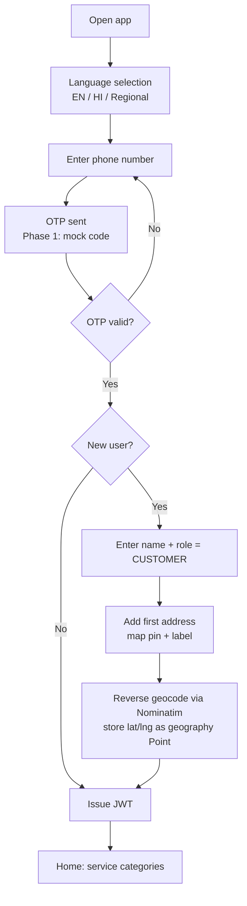

## 7.2 Worker onboarding and verification

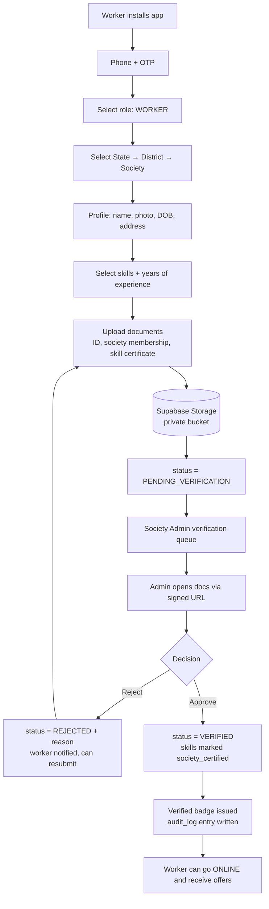

## 7.3 Service discovery and location-based matching

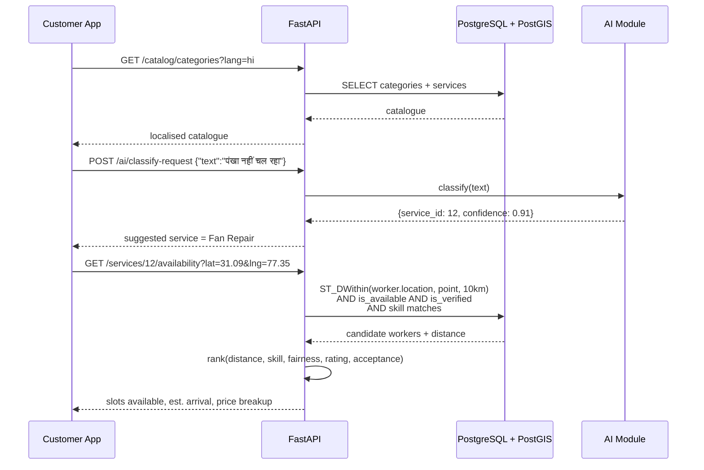

## 7.4 Normal (scheduled) booking

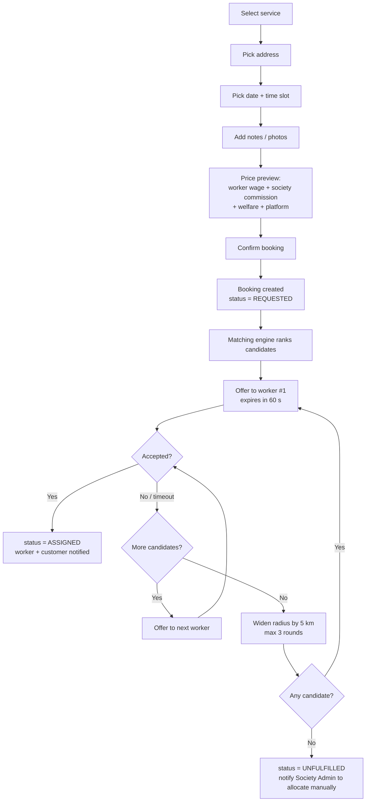

## 7.5 Emergency / on-demand booking

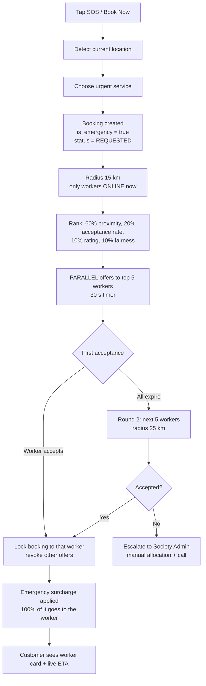

> **Design note worth saying out loud to judges:** the emergency surcharge goes entirely to the worker, not to the platform. That single rule is the clearest expression of the cooperative model in the product.

## 7.6 Worker accept/reject flow

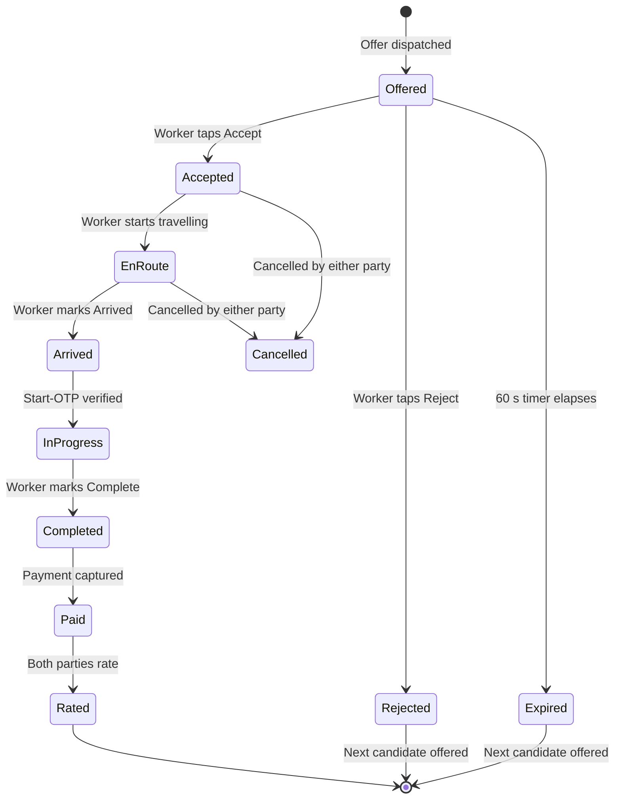

Rejection and expiry are tracked separately: **rejection lowers `acceptance_rate` (a ranking input); expiry does not**, because an expiry may simply mean the worker was mid-job. This distinction matters for fairness and is worth a sentence in the pitch.

## 7.7 Service completion, payment and invoice

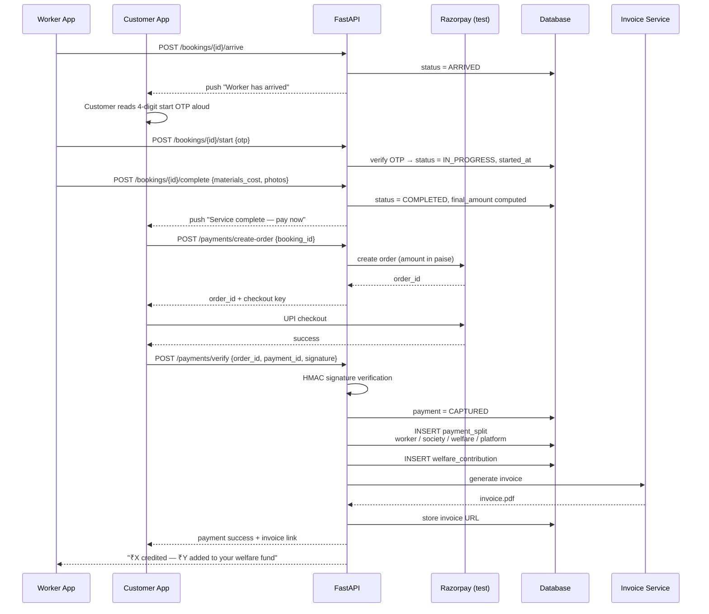

## 7.8 Rating and feedback

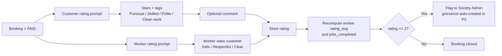

## 7.9 Worker earnings

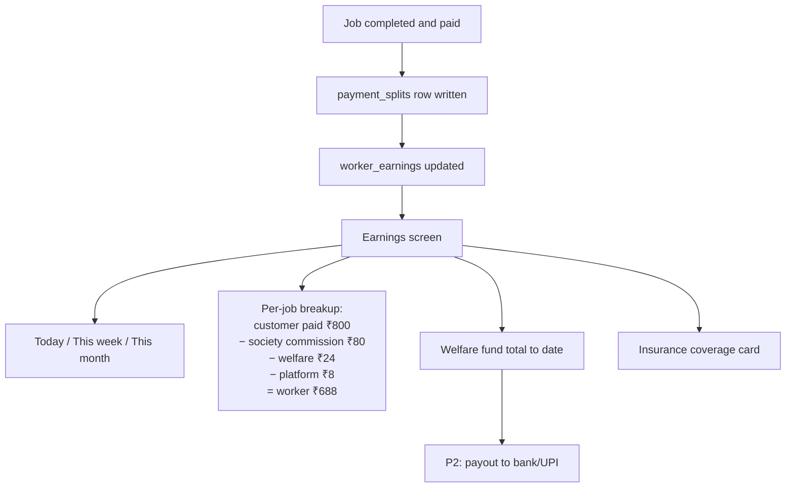

## 7.10 Cooperative administration

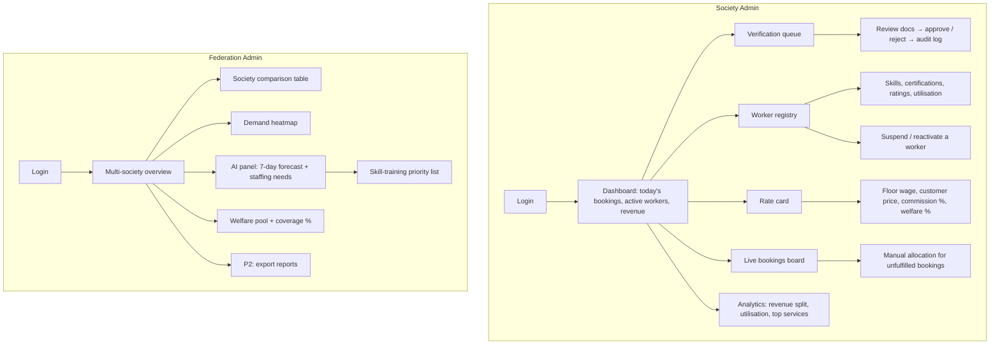

---

# 8. USER ROLES AND RBAC MATRIX

## 8.1 Permission model

Permissions are `resource:action` strings (e.g. `booking:update_status`), grouped into roles. Roles are stored on `users.role`; society and federation scoping comes from `users.society_id` / `users.federation_id`. Every protected endpoint declares a required permission via a FastAPI dependency:

```python
@router.post("/workers/{id}/verify", dependencies=[Depends(require("worker:approve"))])
```

Two scoping rules apply on top of the role check:
- **Society scope** — a `SOCIETY_ADMIN` can only touch rows whose `society_id` equals their own.
- **Federation scope** — a `FEDERATION_ADMIN` can only touch societies whose `federation_id` equals their own.

This is enforced in a single shared query filter so it cannot be forgotten per-endpoint.

## 8.2 RBAC matrix

`C` = Create · `R` = Read · `U` = Update · `D` = Delete · `A` = Approve · `M` = Manage/configure · `—` = no access · `own` = own records only · `soc` = own society only · `fed` = own federation only

| Resource | Customer | Worker | Society Admin | Federation Admin | Super Admin |
|---|---|---|---|---|---|
| Own profile | R U | R U | R U | R U | R U |
| Customer profiles | own | — | R (soc, booking-linked) | R (fed, aggregate) | R U D |
| Worker profiles | R (public fields, booking-linked) | own R U | C R U (soc) | R (fed) | R U D |
| Worker documents | — | own C R | R **A** (soc) | R (fed) | R D |
| Worker verification status | — | own R | **A** (soc) | R, override (fed) | **A** |
| Skills catalogue | R | R | R | R U | C R U D |
| Worker skills | R | own C R U | R U **A** (soc) | R (fed) | R U D |
| Service categories/services | R | R | R | R | **C R U D** |
| Society rate cards | R (price only) | R (own wage) | **C R U** (soc) | R **A** (fed) | R U |
| Societies | R (list) | R (own) | R U (own) | **C R U** (fed) | C R U D |
| Federations | — | — | R (own) | R U (own) | **C R U D** |
| Addresses | own C R U D | R (assigned booking only, after acceptance) | — | — | R |
| Bookings | own C R U(cancel) | assigned R U(status) | R U (soc), manual allocate | R (fed) | R U D |
| Booking offers | — | own R U(accept/reject) | R (soc) | R (fed) | R |
| Payments | own R, initiate | own R (earnings view) | R (soc) | R (fed, aggregate) | R U |
| Payment splits | own R | own R | R (soc) | R (fed) | R U |
| Invoices | own R, download | own R | R (soc) | R (fed) | R |
| Ratings | C (own bookings) R | C (own bookings) R | R (soc), moderate | R (fed) | R U D |
| Welfare ledger | — | own R | R (soc) | R (fed) | R U |
| Insurance policies | — | own R | C R U (soc) | R (fed) | R U D |
| Grievances *(P2)* | own C R | own C R | R U **A** (soc) | R (fed), escalate | R U D |
| Society analytics | — | — | R (soc) | R (fed) | R |
| Federation analytics | — | — | — | R (fed) | R |
| AI forecasts | — | — | R (soc) | R (fed) | R, retrain |
| Audit logs | — | — | R (soc) | R (fed) | R |
| System config | — | — | — | — | **M** |
| Notifications | own R | own R | R soc, send | R fed, send | M |

## 8.3 Sensitive-data access rules

| Data | Rule |
|---|---|
| Customer exact address | Visible to the worker **only after** offer acceptance; before that, only approximate area and distance |
| Customer phone | Masked from the worker until status = `ASSIGNED`; call proxy in Phase 2 |
| Worker phone | Masked from the customer until status = `ASSIGNED` |
| Worker documents | Never public; society admin views through a 5-minute signed URL; every view is logged |
| Payment details | Never stored on our servers; gateway tokens only |
| Bank/UPI details | Stored encrypted at rest; visible only to the worker and to payouts (P2) |

---

# 9. COMPLETE SYSTEM ARCHITECTURE

## 9.1 Architectural principle

**Modular monolith, deployed as one service, structured as if it were many.**

A student team in a hackathon should never write microservices — the operational overhead alone will eat the build window. But the module boundaries should be drawn *now* so that in Phase 3 a module can be lifted out into its own service with a change to its transport layer only.

The rules that make this true:
1. Each module owns its own tables. **No module reads another module's tables directly.**
2. Modules talk to each other through a service-layer function call — a single import line that becomes an HTTP or queue call in Phase 3.
3. All external providers (payments, SMS, KYC, insurance, maps) sit behind an interface with a mock and a real implementation.
4. The API is versioned (`/api/v1`) from the first commit.

## 9.2 High-level system architecture (Phase 1)

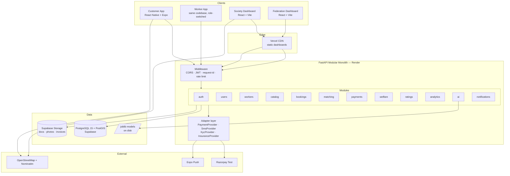

## 9.3 Backend module structure

```
sahaayak-api/
├── app/
│   ├── main.py                 # FastAPI app, router registration
│   ├── core/
│   │   ├── config.py           # pydantic-settings, all env vars
│   │   ├── security.py         # JWT, argon2, permission dependency
│   │   ├── database.py         # engine, session, base
│   │   ├── exceptions.py       # typed API errors
│   │   └── i18n.py             # server-side message keys
│   ├── modules/
│   │   ├── auth/               # router.py · service.py · schemas.py · models.py
│   │   ├── users/
│   │   ├── workers/            # profile, documents, skills, verification
│   │   ├── catalog/            # categories, services, rate cards
│   │   ├── bookings/           # booking lifecycle, offers, OTP
│   │   ├── matching/           # geo query + fair ranking
│   │   ├── payments/           # orders, verification, splits, invoices
│   │   ├── welfare/            # welfare ledger, insurance
│   │   ├── ratings/
│   │   ├── analytics/          # dashboard aggregates
│   │   ├── ai/                 # classifier, forecasting, recommendations
│   │   └── notifications/
│   ├── adapters/
│   │   ├── payment/            # base.py · razorpay.py · mock.py
│   │   ├── sms/                # base.py · msg91.py · mock.py
│   │   ├── kyc/                # base.py · digilocker.py · mock.py
│   │   ├── insurance/          # base.py · eshram.py · mock.py
│   │   └── storage/            # base.py · supabase.py · local.py
│   ├── ml/
│   │   ├── train_classifier.py
│   │   ├── train_forecast.py
│   │   ├── artifacts/          # *.joblib
│   │   └── inference.py
│   └── seed/
│       └── generate_demo_data.py
├── alembic/versions/
├── tests/
├── Dockerfile
└── requirements.txt
```

Each module file has a fixed shape — `router.py` (HTTP only), `service.py` (business logic, the part that survives a microservice split), `repository.py` (DB access), `schemas.py` (Pydantic), `models.py` (SQLAlchemy). **Routers never touch the database directly.** That one discipline is what makes Phase 3 extraction a two-day job instead of a rewrite.

## 9.4 Request flow (booking creation)

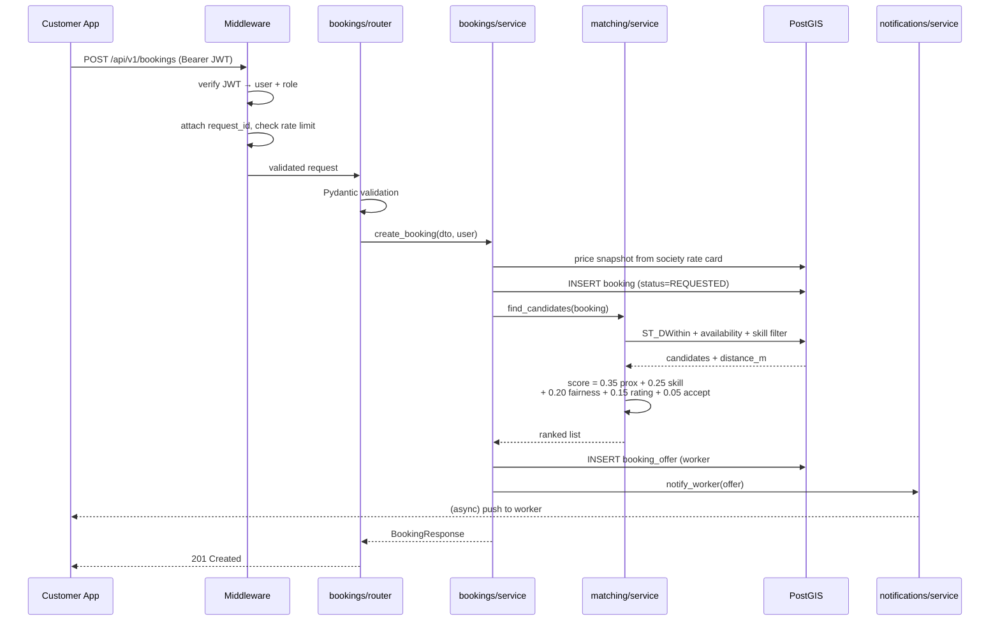

## 9.5 Data flow — from booking to welfare

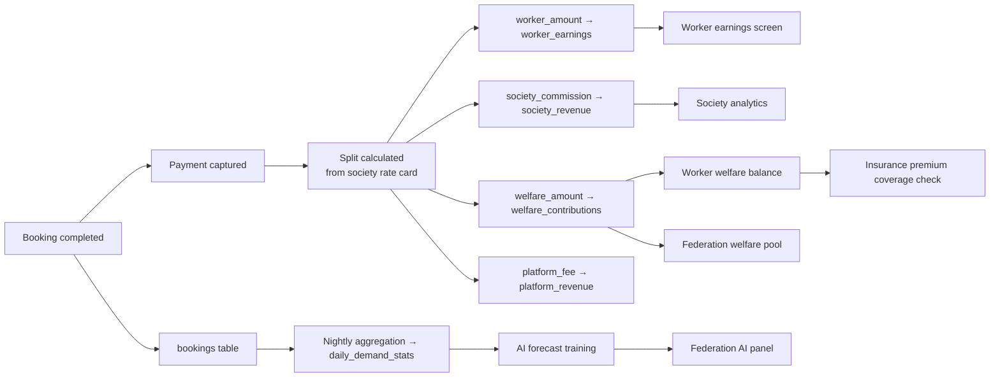

## 9.6 Frontend architecture

**Mobile (React Native + Expo)** — one app, two experiences selected by `user.role` after login.

```
sahaayak-mobile/
├── app/                        # expo-router file-based routes
│   ├── (auth)/                 # login, otp, language
│   ├── (customer)/             # home, search, booking, tracking, history, profile
│   ├── (worker)/               # dashboard, offers, active-job, earnings, profile
│   └── _layout.tsx             # role-based route guard
├── src/
│   ├── api/                    # generated client + typed hooks
│   ├── components/             # shared design system
│   ├── store/                  # Zustand: auth, booking, location
│   ├── i18n/                   # en.json, hi.json, pa.json
│   ├── hooks/
│   └── utils/
```

- **State:** Zustand for client state (small, no boilerplate) + TanStack Query for all server state (caching, retries, background refetch — this is what makes the app feel fast on a bad network).
- **Navigation:** expo-router with a root guard that redirects by role.
- **Offline tolerance:** TanStack Query cache persisted to AsyncStorage so the last screen still renders without a network.

**Web dashboards (React + Vite)** — one app, two dashboards by role.

```
sahaayak-dashboard/
├── src/
│   ├── pages/society/          # workers, verification, rates, bookings, analytics
│   ├── pages/federation/       # overview, societies, heatmap, ai, welfare
│   ├── components/ui/          # shadcn/ui
│   ├── components/charts/      # Recharts wrappers
│   ├── components/map/         # Leaflet wrappers
│   └── lib/api.ts
```

## 9.7 Layer-by-layer decisions

| Layer | Phase 1 | Phase 2 | Phase 3 |
|---|---|---|---|
| **Authentication** | Own JWT: 15-min access + 7-day refresh, argon2 hashes, mock OTP | Real SMS OTP, device binding, DigiLocker eKYC | Federation SSO, MFA for admins, session revocation lists |
| **Authorization** | Role + permission dependency, society/federation query scoping | Fine-grained permissions, delegated verifier role | Postgres row-level security as a second line of defence |
| **API** | REST, `/api/v1`, auto Swagger | + webhooks, idempotency keys, ETags | + GraphQL BFF for dashboards, gRPC between services |
| **Geo** | PostGIS `ST_DWithin` + GIST index | OSRM road distance/ETA, polygon service areas | Zone partitioning, cached distance matrices |
| **AI** | scikit-learn/statsmodels in-process, `.joblib` | Celery-scheduled retraining, LightGBM | Separate AI service, MLflow, feature store |
| **Payments** | Razorpay test orders + signature verification + computed splits | Live capture, Route split settlement, refunds | Escrow, reconciliation, automated payouts, GST invoicing |
| **Notifications** | Expo Push + in-app table | FCM, SMS, WhatsApp, email digests | Multi-channel orchestration with per-user preferences |
| **Storage** | Supabase Storage private buckets, signed URLs | Image compression, virus scanning, CDN | S3-compatible object store with lifecycle rules |
| **Background work** | FastAPI `BackgroundTasks` (offer expiry, push) | Celery + Redis, beat schedule | Distributed queue with retries and DLQ |
| **Caching** | None (correct choice at this scale) | Redis for catalogue, rate cards, availability | Multi-tier cache + read replicas |

> **Deliberate non-decision:** no Redis, no Celery, no Kafka, no microservices, no service mesh in Phase 1. Every one of those would cost a day of setup and buy nothing a judge can see. `BackgroundTasks` handles offer expiry perfectly well at demo scale.

## 9.8 Component interaction map

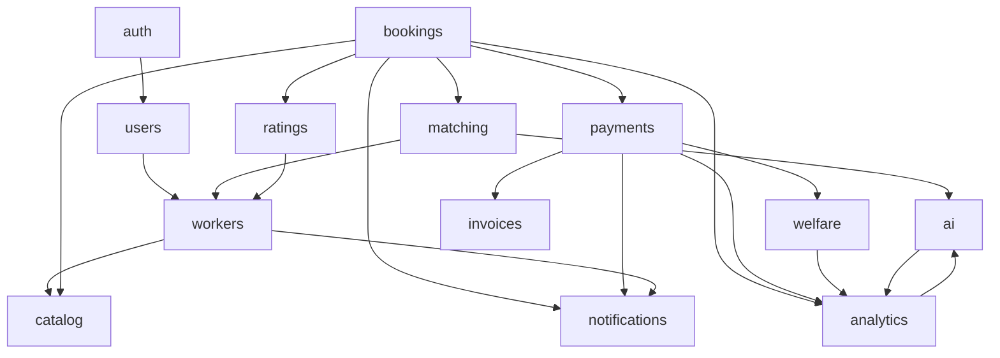

---

# 10. TECHNOLOGY STACK — FULL EVALUATION

Each subsection compares the real options, then commits to one. The recurring tie-breaker: *what can six students ship, deployed and working, on ₹0?*

## 10.1 Mobile application

| Option | Pros | Cons | Free? |
|---|---|---|---|
| **React Native + Expo** | One codebase; runs instantly on a judge's phone via Expo Go; huge ecosystem; shares TypeScript with the web dashboard; OTA updates | Slightly heavier than native; some native modules need a dev build | Yes (EAS free tier for builds) |
| Flutter | Excellent performance and offline support; single codebase; great UI consistency | Dart is a second language for the team; less overlap with the web dashboard | Yes |
| Native Android (Kotlin) | Best performance | Two codebases if iOS is ever needed; slowest to build | Yes |
| PWA only | Fastest to build; no install | No push on iOS; feels like a website; weak "mobile app" claim for a PS that explicitly asks for a mobile application | Yes |

**DECISION: React Native + Expo (TypeScript).**
*Why:* the demo-day argument wins it — a judge can scan a QR code and run the app on their own phone. Type sharing with the React dashboard means one mental model for the whole team. *Limitation:* EAS free builds are rate-limited; mitigate by demoing through Expo Go and building the APK once, in advance. *Free alternative if it fails:* Flutter.

## 10.2 Web dashboard

| Option | Pros | Cons |
|---|---|---|
| **React + Vite + TS** | Instant HMR; minimal config; no SSR complexity for an authenticated dashboard | Manual routing setup |
| Next.js | SSR, routing, API routes built in | SSR is dead weight for a login-gated dashboard; more concepts to learn |
| Vue + Vite | Gentle learning curve | Smaller component ecosystem for admin UIs |
| Angular | Batteries included | Far too heavy for a hackathon |

**DECISION: React 18 + Vite + TypeScript + TailwindCSS + shadcn/ui.**
*Why:* a dashboard behind a login needs no SEO or SSR, and Vite's build loop is the fastest available. shadcn/ui gives production-looking tables, dialogs and forms by copy-paste — a genuine multi-day saving on admin screens, which are exactly where hackathon teams run out of time. All free and MIT-licensed.

## 10.3 Backend

| Option | Pros | Cons |
|---|---|---|
| **FastAPI (Python)** | Same language as the ML layer; automatic OpenAPI docs; Pydantic validation; async; excellent docs | Fewer "batteries" than Django |
| Django + DRF | Free admin panel; mature auth; GeoDjango | Heavier; the free admin tempts you into a bad admin UX; slower iteration |
| Node/Express | Same language as the frontend | Needs a second Python service for ML; weaker validation by default |
| NestJS | Structured, scalable | Steep learning curve mid-hackathon |
| Spring Boot | Enterprise-grade | Far too slow to build in |

**DECISION: FastAPI on Python 3.11, structured as a modular monolith.**
*Why:* the AI requirement in the PS is non-negotiable, and Python keeps the model and the API in one process — no cross-service serialisation, no second deployment. The auto-generated `/docs` page is also a free demo asset: showing judges a complete interactive API doc costs zero extra work. *Limitation:* no built-in admin — which is fine, because we're building a real dashboard anyway.

**Runner-up worth naming in the pitch:** Django+DRF would be the choice if the team were weaker on frontend and wanted the free admin panel.

## 10.4 Database

| Option | Pros | Cons |
|---|---|---|
| **PostgreSQL + PostGIS** | Relational integrity for money and bookings; best-in-class geo-spatial querying; JSONB for flexible fields; scales to Phase 3 | Slightly more setup than a document DB |
| MongoDB | Flexible schema; geo queries available | Weak for financial and relational data; transactions awkward |
| MySQL | Familiar | Geo support far behind PostGIS |
| Firebase Firestore | Realtime, easy | No real geo-radius query; costs escalate; hard to do analytics; vendor lock-in |
| SQLite | Zero setup | No PostGIS, no concurrency — dev only |

**DECISION: PostgreSQL 15 + PostGIS, hosted on Supabase free tier.**
*Why:* this platform is fundamentally about money splits (needs ACID) and location (needs geo indexes). Postgres is the only option that does both natively. `ST_DWithin` with a GIST index answers "verified plumbers within 10 km who are online" in a single indexed query — the core operation of the entire product.
*Free tier limits:* 500 MB database, 1 GB file storage, pauses after 7 days of inactivity (just log in weekly).
*Free alternatives:* Neon (generous free Postgres, PostGIS supported), Railway trial, or a local Docker Postgres for development.

## 10.5 Authentication

| Option | Pros | Cons |
|---|---|---|
| **Own JWT in FastAPI** | Full control; portable; no vendor lock; no cost | Must implement refresh and revocation ourselves |
| Supabase Auth | Ready-made; integrates with the DB | Phone OTP needs a paid SMS provider anyway; couples app logic to the vendor |
| Firebase Auth | Good phone auth | Free SMS quota is now tiny; needs a billing account; second SDK in the app |
| Auth0/Clerk | Polished | Free tiers too small; overkill |

**DECISION: own JWT (access 15 min + refresh 7 days), argon2 password hashing, OTP behind a `SmsProvider` interface with a mock implementation in Phase 1.**
*Why:* every managed option still requires a paid SMS gateway for Indian phone OTP, so the "convenience" buys nothing while adding lock-in. Writing the JWT layer is roughly 150 lines with `python-jose` and `passlib`. Swapping the mock SMS provider for MSG91 in Phase 2 is a one-file change.

## 10.6 Maps and geo-spatial

| Option | Pros | Cons |
|---|---|---|
| **Leaflet + OpenStreetMap** | Completely free; no API key; no billing account; MIT licensed | Tiles are plainer than Google's; usage policy asks for reasonable request rates |
| Google Maps | Best data quality in India | Requires a billing account with a card — a hard blocker for a student team |
| Mapbox | Beautiful | Free tier needs a card and has request caps |
| MapLibre GL | Free fork of Mapbox GL; vector tiles | Needs a tile source; more setup |

**DECISION: Leaflet + OSM tiles on web, `react-native-maps` with an OSM tile overlay on mobile. Geocoding via Nominatim (respecting its usage policy — cache aggressively, one request per second). Distance in Phase 1 from PostGIS `ST_Distance` on the `geography` type. Phase 2 upgrades to OpenRouteService (2,000 free requests/day) or self-hosted OSRM for road distance and ETA.**
*Why:* "no credit card required" is a hard requirement, and it eliminates Google and Mapbox outright.

## 10.7 AI / ML

| Option | Pros | Cons |
|---|---|---|
| **scikit-learn + statsmodels** | Trains in seconds on CPU; interpretable; tiny artefacts; ships inside the API | Not deep learning (which we do not need) |
| Prophet | Great seasonality handling | Heavy install, slow builds on free tiers |
| LightGBM / XGBoost | Strong tabular accuracy | Needs more data than Phase 1 has; save for Phase 2 |
| TensorFlow / PyTorch | Powerful | Enormous overkill; slow deploys; nothing to gain here |
| Hosted LLM APIs | Impressive demos | Costs money and adds a network dependency to a live demo — avoid |

**DECISION: scikit-learn (TF-IDF + LinearSVC classifier) + statsmodels (Holt-Winters/SARIMAX forecasting) + pandas, artefacts persisted with joblib and loaded once at API startup.**
*Why:* the models are small, fast, explainable, and — crucially — run offline with no API key. When a judge asks "is this really AI or a hardcoded chart?", you can open a terminal and retrain the model in front of them in under ten seconds. That is a far stronger answer than an API call.
*Phase 2 upgrade path:* swap the estimator inside the same `forecast_service.py` interface — no architectural change.

## 10.8 Payments

| Option | Pros | Cons |
|---|---|---|
| **Razorpay Test Mode** | Full UPI/card checkout UX; free; excellent docs; Route supports split settlement in Phase 2 | Live mode needs business KYC |
| Cashfree | Good split payouts | Similar KYC requirement |
| Stripe | Great DX | Weak UPI story in India |
| PhonePe/Paytm | Wide reach | Heavier onboarding |
| Pure mock | Zero dependency | Looks fake to judges |

**DECISION: Razorpay Test Mode behind a `PaymentProvider` interface.**
*Why:* test mode gives a genuine checkout screen and genuine webhooks at zero cost — the demo looks and behaves like production. The split is computed and recorded in our own `payment_splits` table, so Phase 2 only has to connect Razorpay Route to actually move the money.

## 10.9 Hosting and deployment

| Layer | Choice | Free tier reality | Alternatives |
|---|---|---|---|
| Dashboard | **Vercel** | 100 GB bandwidth/month; git-push deploy | Netlify, Cloudflare Pages, GitHub Pages |
| API | **Render** (Docker or Python) | Free instance sleeps after 15 min idle, ~50 s cold start | Fly.io, Koyeb, Hugging Face Spaces (Docker, no sleep), Railway trial |
| Database + storage | **Supabase** | 500 MB DB, 1 GB storage, pauses after 7 idle days | Neon, Aiven free, ElephantSQL |
| Keep-alive | **UptimeRobot** | Pings `/health` every 5–10 min so the API never sleeps during judging | cron-job.org |
| CI/CD | **GitHub Actions** | 2,000 min/month private, unlimited public | GitLab CI |
| Errors | **Sentry** | 5,000 events/month | Self-hosted Glitchtip |

**Cold-start warning, and it is the single most likely way a live demo fails:** a sleeping Render instance takes ~50 seconds to wake. Set up UptimeRobot on day one, and additionally hit the API yourself 10 minutes before going on stage.

## 10.10 Supporting choices

| Need | Choice | Why |
|---|---|---|
| ORM | SQLAlchemy 2.0 + GeoAlchemy2 | Native PostGIS types; the standard for FastAPI |
| Migrations | Alembic | Versioned schema from commit one — this is what protects Phases 2 and 3 |
| Validation | Pydantic v2 | Built into FastAPI; fast |
| API client | openapi-typescript-codegen | Generates a typed TS client from FastAPI's OpenAPI schema — no hand-written fetch calls, no drift |
| Server state | TanStack Query | Caching and retries; makes a poor network survivable |
| Client state | Zustand | ~1 KB, no boilerplate, no Redux ceremony |
| Charts | Recharts | Declarative React charts; fastest path to a good-looking dashboard |
| PDF | WeasyPrint | HTML+CSS → PDF; design the invoice in HTML |
| i18n | i18next + react-i18next + expo-localization | Same library on web and mobile; JSON files |
| Push | Expo Push Notifications | Free, works in Expo Go, one API call |
| Email | Brevo free tier | 300 emails/day |
| Testing | pytest + httpx | Enough for the critical paths |
| Lint/format | ruff + black, eslint + prettier | Keeps six people's code consistent |
| Design | Figma free | One shared component library |

---

# 11. DATABASE DESIGN

## 11.1 Design principles

1. **Money is always `BIGINT` paise.** Never float, never decimal-as-string. `₹800.50` is `80050`.
2. **Price is snapshotted onto the booking.** Rate cards change; historical invoices must not.
3. **Locations are `geography(Point, 4326)`** with GIST indexes — not lat/lng float columns.
4. **Soft delete** (`deleted_at`) on user-facing entities; hard delete only on request under DPDP.
5. **Every table** has `id UUID PRIMARY KEY DEFAULT gen_random_uuid()`, `created_at`, `updated_at`.
6. **Phase 3 multi-tenancy is pre-wired:** `federation_id` is present on the tables that will need row-level security later, so adding RLS is a policy change, not a migration of every table.

## 11.2 ER diagram

```mermaid
erDiagram
    FEDERATIONS ||--o{ SOCIETIES : governs
    SOCIETIES ||--o{ WORKERS : registers
    SOCIETIES ||--o{ SOCIETY_SERVICE_RATES : sets
    SOCIETIES ||--o{ BOOKINGS : fulfils
    USERS ||--o| WORKERS : is
    USERS ||--o{ ADDRESSES : has
    USERS ||--o{ BOOKINGS : places
    USERS ||--o{ RATINGS : writes
    WORKERS ||--o{ WORKER_DOCUMENTS : uploads
    WORKERS ||--o{ WORKER_SKILLS : has
    WORKERS ||--o{ BOOKING_OFFERS : receives
    WORKERS ||--o{ BOOKINGS : serves
    WORKERS ||--o{ WELFARE_CONTRIBUTIONS : accrues
    WORKERS ||--o{ INSURANCE_POLICIES : holds
    WORKERS ||--o{ WORKER_AVAILABILITY : declares
    SKILLS ||--o{ WORKER_SKILLS : categorises
    SERVICE_CATEGORIES ||--o{ SERVICES : contains
    SERVICES ||--o{ SOCIETY_SERVICE_RATES : priced_by
    SERVICES ||--o{ BOOKINGS : booked_as
    SERVICES ||--o{ SKILLS : requires
    BOOKINGS ||--o{ BOOKING_OFFERS : dispatches
    BOOKINGS ||--o{ BOOKING_STATUS_HISTORY : logs
    BOOKINGS ||--|| PAYMENTS : settled_by
    BOOKINGS ||--o{ RATINGS : receives
    BOOKINGS ||--o| INVOICES : produces
    PAYMENTS ||--|| PAYMENT_SPLITS : divided_into
    PAYMENTS ||--o| WELFARE_CONTRIBUTIONS : funds
    ADDRESSES ||--o{ BOOKINGS : located_at

    FEDERATIONS {
        uuid id PK
        string name
        string state
        string code UK
        timestamp created_at
    }
    SOCIETIES {
        uuid id PK
        uuid federation_id FK
        string name
        string registration_no UK
        string district
        geography location
        int service_radius_km
        boolean is_active
    }
    USERS {
        uuid id PK
        string phone UK
        string email
        string password_hash
        string full_name
        enum role
        string preferred_language
        uuid society_id FK
        uuid federation_id FK
        boolean is_active
        timestamp created_at
    }
    WORKERS {
        uuid id PK
        uuid user_id FK UK
        uuid society_id FK
        string membership_no
        enum verification_status
        geography base_location
        int service_radius_km
        boolean is_available
        numeric rating_avg
        int total_ratings
        int jobs_completed
        int jobs_last_7d
        numeric acceptance_rate
        string eshram_id
        string upi_vpa
        timestamp verified_at
        uuid verified_by FK
    }
    WORKER_DOCUMENTS {
        uuid id PK
        uuid worker_id FK
        enum doc_type
        string file_path
        enum status
        string rejection_reason
        uuid reviewed_by FK
        timestamp reviewed_at
    }
    SKILLS {
        uuid id PK
        string name_key
        uuid category_id FK
    }
    WORKER_SKILLS {
        uuid id PK
        uuid worker_id FK
        uuid skill_id FK
        int years_experience
        boolean society_certified
        string certificate_path
    }
    SERVICE_CATEGORIES {
        uuid id PK
        string name_key
        string icon
        int display_order
    }
    SERVICES {
        uuid id PK
        uuid category_id FK
        string name_key
        uuid required_skill_id FK
        int default_duration_min
        boolean emergency_enabled
        boolean is_active
    }
    SOCIETY_SERVICE_RATES {
        uuid id PK
        uuid society_id FK
        uuid service_id FK
        bigint customer_price_paise
        bigint floor_wage_paise
        numeric commission_pct
        numeric welfare_pct
        numeric platform_pct
        numeric emergency_surcharge_pct
        boolean is_active
    }
    ADDRESSES {
        uuid id PK
        uuid user_id FK
        string label
        string line1
        string city
        string pincode
        geography location
        boolean is_default
    }
    BOOKINGS {
        uuid id PK
        string booking_code UK
        uuid customer_id FK
        uuid service_id FK
        uuid address_id FK
        uuid society_id FK
        uuid worker_id FK
        enum status
        boolean is_emergency
        timestamp scheduled_at
        bigint quoted_price_paise
        bigint materials_cost_paise
        bigint final_price_paise
        string start_otp
        text customer_notes
        timestamp started_at
        timestamp completed_at
        timestamp created_at
    }
    BOOKING_OFFERS {
        uuid id PK
        uuid booking_id FK
        uuid worker_id FK
        int rank_position
        numeric match_score
        jsonb score_breakdown
        int distance_m
        enum response
        timestamp sent_at
        timestamp expires_at
        timestamp responded_at
    }
    BOOKING_STATUS_HISTORY {
        uuid id PK
        uuid booking_id FK
        enum from_status
        enum to_status
        uuid changed_by FK
        text reason
        timestamp created_at
    }
    PAYMENTS {
        uuid id PK
        uuid booking_id FK UK
        string provider
        string provider_order_id
        string provider_payment_id
        bigint amount_paise
        enum method
        enum status
        timestamp paid_at
    }
    PAYMENT_SPLITS {
        uuid id PK
        uuid payment_id FK UK
        bigint worker_amount_paise
        bigint society_commission_paise
        bigint welfare_amount_paise
        bigint platform_fee_paise
        jsonb calculation_snapshot
    }
    INVOICES {
        uuid id PK
        uuid booking_id FK UK
        string invoice_no UK
        string pdf_path
        timestamp issued_at
    }
    RATINGS {
        uuid id PK
        uuid booking_id FK
        uuid rated_by FK
        uuid rated_user FK
        int stars
        jsonb tags
        text comment
        timestamp created_at
    }
    WELFARE_CONTRIBUTIONS {
        uuid id PK
        uuid worker_id FK
        uuid payment_id FK
        bigint amount_paise
        string scheme
        enum status
        timestamp created_at
    }
    INSURANCE_POLICIES {
        uuid id PK
        uuid worker_id FK
        string scheme
        string policy_no
        bigint coverage_paise
        date valid_from
        date valid_to
        enum status
    }
    WORKER_AVAILABILITY {
        uuid id PK
        uuid worker_id FK
        int day_of_week
        time start_time
        time end_time
    }
```

## 11.3 Key table definitions (DDL sketch)

```sql
-- Enums
CREATE TYPE user_role AS ENUM ('CUSTOMER','WORKER','SOCIETY_ADMIN','FEDERATION_ADMIN','SUPER_ADMIN');
CREATE TYPE verification_status AS ENUM ('PENDING','UNDER_REVIEW','VERIFIED','REJECTED','SUSPENDED');
CREATE TYPE booking_status AS ENUM
  ('REQUESTED','ASSIGNED','EN_ROUTE','ARRIVED','IN_PROGRESS','COMPLETED','PAID','CANCELLED','UNFULFILLED');
CREATE TYPE offer_response AS ENUM ('PENDING','ACCEPTED','REJECTED','EXPIRED','REVOKED');
CREATE TYPE payment_status AS ENUM ('CREATED','PENDING','CAPTURED','FAILED','REFUNDED');

CREATE TABLE workers (
    id                  UUID PRIMARY KEY DEFAULT gen_random_uuid(),
    user_id             UUID NOT NULL UNIQUE REFERENCES users(id) ON DELETE CASCADE,
    society_id          UUID NOT NULL REFERENCES societies(id),
    membership_no       VARCHAR(50),
    verification_status verification_status NOT NULL DEFAULT 'PENDING',
    base_location       geography(Point,4326),
    service_radius_km   INT NOT NULL DEFAULT 10,
    is_available        BOOLEAN NOT NULL DEFAULT false,
    rating_avg          NUMERIC(3,2) NOT NULL DEFAULT 0,
    total_ratings       INT NOT NULL DEFAULT 0,
    jobs_completed      INT NOT NULL DEFAULT 0,
    jobs_last_7d        INT NOT NULL DEFAULT 0,   -- fairness input, refreshed nightly
    acceptance_rate     NUMERIC(4,3) NOT NULL DEFAULT 1.000,
    eshram_id           VARCHAR(20),
    upi_vpa             VARCHAR(100),
    verified_at         TIMESTAMPTZ,
    verified_by         UUID REFERENCES users(id),
    created_at          TIMESTAMPTZ NOT NULL DEFAULT now(),
    updated_at          TIMESTAMPTZ NOT NULL DEFAULT now(),
    deleted_at          TIMESTAMPTZ
);

-- The index that makes the whole product work
CREATE INDEX idx_workers_location   ON workers USING GIST (base_location);
CREATE INDEX idx_workers_dispatch   ON workers (society_id, verification_status, is_available)
    WHERE deleted_at IS NULL;

CREATE TABLE bookings (
    id                   UUID PRIMARY KEY DEFAULT gen_random_uuid(),
    booking_code         VARCHAR(20) NOT NULL UNIQUE,          -- SHY-2026-000123
    customer_id          UUID NOT NULL REFERENCES users(id),
    service_id           UUID NOT NULL REFERENCES services(id),
    address_id           UUID NOT NULL REFERENCES addresses(id),
    society_id           UUID NOT NULL REFERENCES societies(id),
    worker_id            UUID REFERENCES workers(id),
    status               booking_status NOT NULL DEFAULT 'REQUESTED',
    is_emergency         BOOLEAN NOT NULL DEFAULT false,
    scheduled_at         TIMESTAMPTZ,
    quoted_price_paise   BIGINT NOT NULL,
    materials_cost_paise BIGINT NOT NULL DEFAULT 0,
    final_price_paise    BIGINT,
    rate_snapshot        JSONB NOT NULL,   -- the full rate card at booking time
    start_otp            CHAR(4),
    customer_notes       TEXT,
    started_at           TIMESTAMPTZ,
    completed_at         TIMESTAMPTZ,
    created_at           TIMESTAMPTZ NOT NULL DEFAULT now()
);

CREATE INDEX idx_bookings_customer  ON bookings (customer_id, created_at DESC);
CREATE INDEX idx_bookings_worker    ON bookings (worker_id, status);
CREATE INDEX idx_bookings_society   ON bookings (society_id, created_at DESC);
CREATE INDEX idx_bookings_forecast  ON bookings (society_id, service_id, created_at);
```

## 11.4 Analytics tables (populated nightly)

```sql
CREATE TABLE daily_demand_stats (
    id           UUID PRIMARY KEY DEFAULT gen_random_uuid(),
    society_id   UUID NOT NULL REFERENCES societies(id),
    service_id   UUID NOT NULL REFERENCES services(id),
    stat_date    DATE NOT NULL,
    bookings_requested INT NOT NULL DEFAULT 0,
    bookings_fulfilled INT NOT NULL DEFAULT 0,
    bookings_unfulfilled INT NOT NULL DEFAULT 0,
    avg_response_seconds INT,
    revenue_paise BIGINT NOT NULL DEFAULT 0,
    UNIQUE (society_id, service_id, stat_date)
);

CREATE TABLE demand_forecasts (
    id             UUID PRIMARY KEY DEFAULT gen_random_uuid(),
    society_id     UUID NOT NULL REFERENCES societies(id),
    service_id     UUID NOT NULL REFERENCES services(id),
    forecast_date  DATE NOT NULL,
    predicted_bookings NUMERIC(8,2) NOT NULL,
    lower_bound    NUMERIC(8,2),
    upper_bound    NUMERIC(8,2),
    workers_needed INT,
    model_version  VARCHAR(50),
    generated_at   TIMESTAMPTZ NOT NULL DEFAULT now(),
    UNIQUE (society_id, service_id, forecast_date, model_version)
);
```

`daily_demand_stats` exists so the forecasting model never has to scan the raw `bookings` table — the aggregation is the training set. This is the single decision that keeps the AI layer fast in Phase 3 with millions of bookings.

## 11.5 Why this schema survives all three phases

| Phase 2/3 need | Already supported because |
|---|---|
| Split settlement to real accounts | `payment_splits` already stores every component separately |
| Real insurance enrolment | `insurance_policies` + `welfare_contributions` already exist; only the adapter changes |
| Road distance and ETA | `booking_offers.distance_m` and `score_breakdown` JSONB absorb new fields without migration |
| Availability calendar | `worker_availability` table exists from day one, unused in Phase 1 |
| Multi-tenant isolation | `federation_id` denormalised where RLS will need it |
| Grievances | New table with an FK to `bookings`; nothing existing changes |
| ONDC | New adapter + a `source_channel` column on bookings |
| Recurring bookings | New `booking_series` table; `bookings` gets a nullable `series_id` |

---

# 12. GEO-SPATIAL ARCHITECTURE

## 12.1 What we store

| Entity | Geo data | Source |
|---|---|---|
| Customer address | `geography(Point,4326)` | Map pin dragged by the user, or device GPS |
| Worker base location | `geography(Point,4326)` | Set at registration, editable |
| Worker service radius | `service_radius_km` INT | Worker sets it (default 10 km) |
| Society | `geography(Point,4326)` + radius | Set by the Society Admin |
| *(Phase 2)* Service area | `geography(Polygon,4326)` | Drawn on the map |

`geography` rather than `geometry` is a deliberate choice: it computes distances in metres on a spheroid, so no projection maths is needed anywhere in the application code.

## 12.2 Phase 1 matching query

```sql
SELECT
    w.id,
    w.rating_avg,
    w.jobs_last_7d,
    w.acceptance_rate,
    ST_Distance(w.base_location, :customer_point) AS distance_m
FROM workers w
JOIN worker_skills ws ON ws.worker_id = w.id
JOIN users u         ON u.id = w.user_id
WHERE w.verification_status = 'VERIFIED'
  AND w.is_available = true
  AND w.deleted_at IS NULL
  AND u.is_active = true
  AND ws.skill_id = :required_skill_id
  AND w.society_id = ANY(:eligible_society_ids)
  AND ST_DWithin(w.base_location, :customer_point, :radius_m)
  AND ST_Distance(w.base_location, :customer_point) <= w.service_radius_km * 1000
ORDER BY distance_m
LIMIT 50;
```

`ST_DWithin` with the GIST index is index-accelerated; the redundant `ST_Distance` filter afterwards enforces the *worker's own* radius preference, which is the part that respects worker autonomy. Sub-100 ms at demo scale, comfortably under 500 ms at 10k workers.

## 12.3 Ranking — the fairness engine

Candidates from the SQL query are scored in Python. **This is the most important 30 lines in the codebase and the thing that most differentiates Sahaayak from a private aggregator.**

```python
def score_candidate(c, ctx) -> tuple[float, dict]:
    # 1. Proximity — linear decay to the search radius
    proximity = max(0.0, 1 - (c.distance_m / ctx.radius_m))

    # 2. Skill match — certified skill and depth of experience
    skill = 0.6 * float(c.society_certified) + 0.4 * min(c.years_experience / 10, 1.0)

    # 3. FAIRNESS — the inverse of recent workload.
    #    A worker with few jobs in the last 7 days is boosted.
    fairness = 1 - min(c.jobs_last_7d / ctx.society_avg_jobs_7d, 1.0) if ctx.society_avg_jobs_7d else 0.5

    # 4. Quality — new workers get a neutral 0.7 so they are not frozen out
    quality = (c.rating_avg / 5.0) if c.total_ratings >= 3 else 0.7

    # 5. Reliability
    reliability = float(c.acceptance_rate)

    w = ctx.weights            # emergency vs scheduled use different weights
    score = (w.proximity * proximity + w.skill * skill + w.fairness * fairness
             + w.quality * quality + w.reliability * reliability)

    return score, {
        "proximity": round(proximity, 3), "skill": round(skill, 3),
        "fairness": round(fairness, 3), "quality": round(quality, 3),
        "reliability": round(reliability, 3), "final": round(score, 3),
    }
```

**Weight profiles**

| Factor | Scheduled booking | Emergency booking |
|---|---|---|
| Proximity | 0.35 | 0.60 |
| Skill match | 0.25 | 0.10 |
| **Fairness** | **0.20** | **0.10** |
| Quality (rating) | 0.15 | 0.10 |
| Reliability | 0.05 | 0.10 |

Two properties worth defending in front of judges:
- **New workers are not frozen out.** A worker with fewer than 3 ratings gets a neutral 0.7 quality score instead of 0 — the cold-start trap that leaves new workers on private platforms permanently jobless.
- **The score is explainable.** `score_breakdown` is stored as JSONB on every offer, so a Society Admin can open any booking and see exactly why worker A was offered before worker B. Try getting that from a private aggregator.

## 12.4 Expanding-radius dispatch

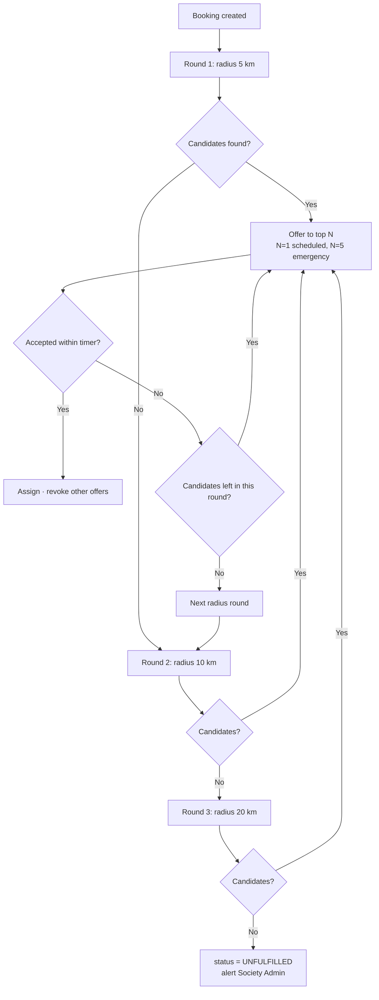

Scheduled bookings dispatch **sequentially** (one worker at a time, 60 s each) because there is time. Emergency bookings dispatch **in parallel** to the top 5 with a 30 s timer, first-accept-wins, because speed matters more than perfect ordering.

## 12.5 Phase 2 and 3 geo evolution

| Capability | Phase 2 | Phase 3 |
|---|---|---|
| Distance | OSRM / OpenRouteService road distance + ETA | Cached distance matrices per zone |
| Service area | Polygon boundaries (`ST_Contains`) instead of a circle | Auto-suggested polygons learnt from historical jobs |
| Tracking | Worker position updates over Supabase Realtime | Continuous tracking with geofenced arrival detection |
| Demand geography | H3 hex-binned demand heatmap | Zone-level supply/demand balancing |
| Routing | Single-job navigation | Multi-job route optimisation for a worker's day |

Critically, none of these change the schema: `booking_offers.distance_m` simply starts carrying road distance instead of straight-line distance, and the `score_breakdown` JSONB absorbs new factors.

---

# 13. AI ARCHITECTURE

The PS names "AI-based demand forecasting and workforce allocation" as an expected feature. The strategy here is to build **three small, genuinely working models** rather than one large one that half-works — and to make sure each is defensible when a judge asks "is this actually a model?"

## 13.1 Phase 1 — three shipped models

### Model A — Service Request Classifier *(MUST BUILD)*

| Aspect | Detail |
|---|---|
| **Purpose** | Turn a natural-language complaint into a service category, so a low-literacy user can type or speak instead of navigating menus |
| **Input** | Free text in Hindi/English/Hinglish — "पंखा नहीं चल रहा", "tap leaking in kitchen", "need someone for elderly care" |
| **Features** | TF-IDF over character n-grams (3–5) — deliberately character-level so it survives spelling variation and transliteration |
| **Model** | `LinearSVC` (scikit-learn), one-vs-rest over ~25 service classes |
| **Training data** | ~800 hand-written + template-generated phrases across services and languages, in a CSV committed to the repo |
| **Training** | `python -m app.ml.train_classifier` — under 10 seconds on a laptop |
| **Output** | `{service_id, service_name, confidence}`; below 0.45 confidence, fall back to showing the top 3 categories |
| **Deployment** | `classifier.joblib` (~2 MB) loaded once at FastAPI startup; inference under 5 ms |
| **Why it is defensible** | You can retrain it live in front of a judge |

### Model B — Demand Forecasting *(MUST BUILD)*

| Aspect | Detail |
|---|---|
| **Purpose** | Predict bookings per society × service for the next 7 days, and convert that into a worker-count recommendation |
| **Input** | `daily_demand_stats` — a daily count time series per (society, service) |
| **Features** | Level, weekly seasonality, trend; plus day-of-week and month indicators |
| **Model** | `ExponentialSmoothing` (Holt-Winters, additive trend + weekly seasonality) from statsmodels, with a seasonal-naive fallback for series shorter than 3 weeks |
| **Training** | Nightly (Phase 1: on demand + at startup) per series; each fit takes milliseconds |
| **Output** | `predicted_bookings`, `lower_bound`, `upper_bound`, and `workers_needed = ceil(predicted / jobs_per_worker_per_day)` |
| **Storage** | Written to `demand_forecasts` so the dashboard reads a table, never waits on a model |
| **Validation** | MAPE on a held-out final 14 days, displayed in the admin panel — showing the error metric is far more convincing than showing only the prediction |

```python
def forecast_series(daily_counts: pd.Series, horizon: int = 7):
    if len(daily_counts) < 21:
        return seasonal_naive(daily_counts, horizon)      # honest fallback
    model = ExponentialSmoothing(
        daily_counts, trend="add", seasonal="add", seasonal_periods=7,
        initialization_method="estimated",
    ).fit()
    forecast = model.forecast(horizon)
    resid_std = model.resid.std()
    return pd.DataFrame({
        "predicted": forecast.clip(lower=0),
        "lower": (forecast - 1.96 * resid_std).clip(lower=0),
        "upper": forecast + 1.96 * resid_std,
    })
```

### Model C — Fair Workforce Allocation *(MUST BUILD — rule-based, and say so)*

Two outputs, both deterministic and explainable:
1. **Per-booking ranking** — the weighted scorer in §12.3.
2. **Per-area staffing recommendation** — `workers_needed` from Model B compared with currently verified available workers, producing a gap or surplus per service and area.

```
Shimla Society · next 7 days
  Plumbing      forecast 42 jobs → need 7 workers → have 4  → SHORTAGE 3
  Electrical    forecast 31 jobs → need 5 workers → have 9  → surplus 4
  Elder care    forecast 18 jobs → need 4 workers → have 1  → SHORTAGE 3  ← training priority
```

**Be honest that Model C is rules-based, not learned.** Judges respect a team that distinguishes "we used a weighted scoring function here because it is explainable and auditable" from "we called it AI." That honesty also sets up the Phase 3 answer: OR-Tools optimisation once there is real data.

### Skill-training priority *(derived, not a model)*
Rank services by `(forecast_shortage × avg_revenue_per_job × unfulfilled_rate)` to produce the Federation's training priority list. This is the output that connects directly to NCCT's actual mandate — worth pointing at explicitly in the pitch.

## 13.2 Phase 1 AI data flow

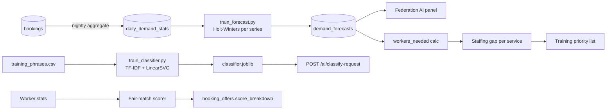

## 13.3 Phase 2 AI

| Model | Purpose | Approach |
|---|---|---|
| Demand forecast v2 | Better accuracy with external signals | LightGBM on lag features + weather + festival calendar + holidays; compare against the Holt-Winters baseline and keep whichever wins per series |
| Offer-rejection risk | Dispatch to workers likely to accept, without punishing anyone | Logistic regression on distance, time of day, job value, worker history |
| ETA prediction | Realistic arrival times | Gradient boosting on road distance, time of day, historical actuals |
| Review sentiment | Flag quality problems early | Multilingual MiniLM / IndicBERT embeddings + logistic classifier; runs on CPU |
| Voice intent | Spoken booking in Indian languages | Bhashini ASR (free for public-interest use) → existing classifier |
| Fraud signals | Detect collusive ratings, fake completions | Isolation Forest on booking and rating patterns |

## 13.4 Phase 3 AI

| Capability | Approach |
|---|---|
| **Workforce allocation optimisation** | Google OR-Tools CP-SAT: assign workers to a day's bookings minimising total travel while enforcing hard constraints — floor wage met, max jobs/day, skill match, and a *fairness floor* (minimum jobs per available worker per week) |
| Dynamic fair pricing | Demand-responsive pricing with a hard constraint that the worker's take never drops below the society floor wage |
| Skill-gap forecasting | Project 6–12 month demand by district → training curriculum planning for NCCT |
| Worker career pathing | Recommend the next certification by expected income lift |
| MLOps | MLflow model registry, scheduled retraining, drift detection on input distributions, champion/challenger evaluation |

**Model governance from Phase 1:** `model_version` is stored on every forecast row, and `score_breakdown` on every offer. Which means every AI decision in the system is reproducible and auditable — a genuinely strong claim for a government-facing platform, and cheap to implement now.

---

# 14. API DESIGN

## 14.1 Conventions

- Base: `https://api.sahaayak.app/api/v1`
- Auth: `Authorization: Bearer <access_token>`
- All money in **paise** as integers.
- All timestamps ISO 8601 UTC.
- Pagination: `?page=1&size=20` → `{items, total, page, size, pages}`.
- Every response carries `X-Request-ID`.
- Idempotency on booking and payment creation via an `Idempotency-Key` header (Phase 2 enforced, Phase 1 accepted and ignored).

## 14.2 Endpoint map

```
AUTH        POST   /auth/send-otp
            POST   /auth/verify-otp
            POST   /auth/register
            POST   /auth/refresh
            POST   /auth/logout
            GET    /auth/me

USERS       GET    /users/me            PATCH /users/me
            GET    /users/me/addresses  POST  /users/me/addresses
            PATCH  /users/me/addresses/{id}   DELETE /users/me/addresses/{id}

CATALOG     GET    /catalog/categories
            GET    /catalog/services?category_id=&lang=
            GET    /catalog/services/{id}
            GET    /catalog/services/{id}/pricing?lat=&lng=

WORKERS     POST   /workers/register
            GET    /workers/me           PATCH /workers/me
            POST   /workers/me/documents
            GET    /workers/me/skills    POST  /workers/me/skills
            PATCH  /workers/me/availability
            GET    /workers/me/earnings?period=
            GET    /workers/me/welfare
            GET    /workers/{id}/public

BOOKINGS    POST   /bookings
            POST   /bookings/emergency
            GET    /bookings?status=&role=
            GET    /bookings/{id}
            POST   /bookings/{id}/cancel
            POST   /bookings/{id}/arrive
            POST   /bookings/{id}/start        (start OTP)
            POST   /bookings/{id}/complete
            GET    /bookings/{id}/invoice

OFFERS      GET    /offers/me                   (worker's pending offers)
            POST   /offers/{id}/accept
            POST   /offers/{id}/reject

PAYMENTS    POST   /payments/create-order
            POST   /payments/verify
            POST   /payments/webhook
            GET    /payments/{id}

RATINGS     POST   /ratings
            GET    /ratings/worker/{worker_id}

AI          POST   /ai/classify-request
            GET    /ai/forecast?society_id=&days=7
            GET    /ai/workforce-recommendation?society_id=
            GET    /ai/training-priorities?federation_id=

SOCIETY     GET    /society/dashboard
            GET    /society/workers
            GET    /society/workers/pending
            POST   /society/workers/{id}/verify
            POST   /society/workers/{id}/reject
            GET    /society/rates          PUT /society/rates/{service_id}
            GET    /society/bookings
            POST   /society/bookings/{id}/assign
            GET    /society/analytics

FEDERATION  GET    /federation/dashboard
            GET    /federation/societies
            GET    /federation/analytics
            GET    /federation/heatmap
            GET    /federation/welfare-pool
```

## 14.3 Example — create an emergency booking

**Request**
```http
POST /api/v1/bookings/emergency
Authorization: Bearer eyJhbGciOi...
Content-Type: application/json

{
  "service_id": "9f1c...",
  "address_id": "3ba7...",
  "customer_notes": "No power in the whole house",
  "lat": 31.1048,
  "lng": 77.1734
}
```

**Response `201`**
```json
{
  "id": "b12f...",
  "booking_code": "SHY-2026-000418",
  "status": "REQUESTED",
  "is_emergency": true,
  "service": { "id": "9f1c...", "name": "Emergency Electrical Repair" },
  "pricing": {
    "base_price_paise": 60000,
    "emergency_surcharge_paise": 12000,
    "estimated_total_paise": 72000,
    "breakdown": {
      "worker_amount_paise": 63600,
      "society_commission_paise": 6000,
      "welfare_amount_paise": 1800,
      "platform_fee_paise": 600
    },
    "note_key": "pricing.emergency_surcharge_to_worker"
  },
  "matching": { "status": "SEARCHING", "candidates_found": 5, "search_radius_km": 15 },
  "created_at": "2026-09-02T14:22:11Z"
}
```

## 14.4 Example — worker accepts an offer

**Request** `POST /api/v1/offers/{offer_id}/accept`

**Response `200`**
```json
{
  "booking": {
    "id": "b12f...",
    "booking_code": "SHY-2026-000418",
    "status": "ASSIGNED",
    "customer": { "name": "Meena S.", "phone": "+91-98XXXXXX12" },
    "address": {
      "line1": "House 24, Sector 4, Sanjauli",
      "city": "Shimla", "pincode": "171006",
      "lat": 31.1048, "lng": 77.1734
    },
    "distance_m": 2340,
    "earning_paise": 63600,
    "start_otp_required": true
  },
  "message_key": "offer.accepted_navigate_now"
}
```

Note that the full address and phone appear **only in this response** — never in the offer itself. That is NFR-8 implemented at the API contract level.

## 14.5 Example — payment verification and split

**Request**
```http
POST /api/v1/payments/verify
{
  "booking_id": "b12f...",
  "razorpay_order_id": "order_NxQ...",
  "razorpay_payment_id": "pay_NxR...",
  "razorpay_signature": "9ef4b2..."
}
```

**Response `200`**
```json
{
  "payment": { "id": "p88a...", "status": "CAPTURED", "amount_paise": 72000, "method": "UPI" },
  "split": {
    "worker_amount_paise": 63600,
    "society_commission_paise": 6000,
    "welfare_amount_paise": 1800,
    "platform_fee_paise": 600,
    "calculation_snapshot": {
      "commission_pct": 10.0, "welfare_pct": 3.0, "platform_pct": 1.0,
      "emergency_surcharge_to_worker": true
    }
  },
  "welfare": { "contributed_paise": 1800, "worker_total_paise": 47400, "insurance_status": "ACTIVE" },
  "invoice": { "invoice_no": "SHY/2026-27/000418", "download_url": "https://.../invoice.pdf" }
}
```

## 14.6 Error format

```json
{
  "error": {
    "code": "WORKER_NOT_AVAILABLE",
    "message_key": "errors.worker_not_available",
    "message": "No verified worker is available in your area right now.",
    "details": { "searched_radius_km": 20, "society_id": "..." },
    "request_id": "req_01HX..."
  }
}
```

Every error carries a `message_key` so the **client** localises it. The English `message` is a developer fallback, never shown to a user in production.

| HTTP | Meaning |
|---|---|
| 400 | Validation failed |
| 401 | Missing/invalid token |
| 403 | Authenticated but not permitted (wrong role or wrong society scope) |
| 404 | Not found |
| 409 | State conflict (offer already accepted, booking already cancelled) |
| 422 | Business rule violated (price below floor wage) |
| 429 | Rate limited |
| 500 | Server error — always logged with the request ID |

---

# 15. FRONTEND INFORMATION ARCHITECTURE

## 15.1 Customer app (React Native)

| # | Screen | Purpose | Key actions | Components |
|---|---|---|---|---|
| C0 | Language select | First launch | Pick EN/HI/regional | Language cards with native script |
| C1 | Phone login | Auth | Enter phone → OTP | Phone input, OTP boxes |
| C2 | **Home** | Discovery | Browse categories, search, AI text box, emergency button | Category grid, search bar, **SOS button**, address chip |
| C3 | Category list | Browse | Select a service | Service cards with price |
| C4 | Service detail | Decide | View inclusions and price breakup | **Transparent price breakup card**, duration, FAQ |
| C5 | Address picker | Location | Drop a pin, save address | Leaflet map, pin, saved list |
| C6 | Slot picker | Schedule | Pick date + time | Date strip, slot grid with availability |
| C7 | Booking review | Confirm | Notes, photos, confirm | Summary card, price breakup |
| C8 | **Matching** | Wait | See search progress | Animated radar, "searching 5 verified workers within 15 km" |
| C9 | **Worker assigned** | Trust | View worker, call, cancel | **Worker card: photo, society badge, rating, distance, skills** |
| C10 | Live status | Track | Follow status, share OTP | Status timeline, map, **start-OTP card** |
| C11 | Completion | Pay | Review final amount, pay | Final bill, materials line, Pay button |
| C12 | Payment | Transact | UPI checkout | Razorpay checkout |
| C13 | Success | Close loop | Download invoice, rate | Split visualisation, invoice button |
| C14 | Rating | Feedback | Stars, tags, comment | Star input, tag chips |
| C15 | Bookings | History | Filter, rebook, invoice | Booking list |
| C16 | Profile | Manage | Addresses, language, help | Settings list |

**Navigation:** bottom tabs — Home · Bookings · Profile. Emergency is a persistent floating action button, reachable from anywhere in two taps.

## 15.2 Worker app (same codebase, role-gated)

| # | Screen | Purpose | Key actions |
|---|---|---|---|
| W0 | Registration | Onboard | Select society, profile, skills, upload documents |
| W1 | Verification pending | Status | See stage, resubmit rejected documents |
| W2 | **Dashboard** | Home | **Online/offline toggle**, today's earnings, active job, offers |
| W3 | **Offer modal** | Decide | Distance, pay, time, **60-second countdown**, Accept / Reject |
| W4 | Active job | Deliver | En route → Arrived → **Enter start OTP** → Complete |
| W5 | Job complete | Close | Add materials cost, upload photos, submit |
| W6 | **Earnings** | Income | Today/week/month, per-job breakup, **welfare fund total** |
| W7 | **Welfare & insurance** | Security | Contributions to date, policy card, coverage |
| W8 | Profile | Manage | Skills, certificates, radius, availability, badge |
| W9 | Ratings | Reputation | Rating average, recent reviews, tags |

**Navigation:** bottom tabs — Dashboard · Jobs · Earnings · Profile. The online/offline toggle sits in the header on every screen.

**Design constraints for the worker app specifically** (these are usability requirements, not decoration): minimum 18sp text, 56dp touch targets, icon + text on every action, high contrast for outdoor daylight readability, and no screen that requires reading more than one sentence to act.

## 15.3 Society Admin dashboard (React web)

| Screen | Purpose | Key components |
|---|---|---|
| Overview | Daily operations | KPI cards (today's bookings, active workers, revenue, avg rating), live booking feed, alerts |
| **Verification queue** | Approve workers | Table of pending workers, document viewer, **Approve/Reject with reason** |
| Worker registry | Manage members | Searchable table: name, skills, status, rating, **utilisation bar**, jobs this week; suspend/reactivate |
| Worker detail | Deep dive | Profile, documents, skills, booking history, earnings, ratings |
| **Rate card** | Fair wage control | Per-service editable table: customer price, **floor wage**, commission %, welfare %; live preview of the resulting split |
| Bookings | Operations | Filterable table, status, **manual allocation for unfulfilled bookings** |
| Analytics | Insight | Bookings over time, revenue split donut, top services, **worker utilisation distribution** |
| Grievances *(P2)* | Resolution | Ticket list, SLA, resolution notes |

## 15.4 Federation Admin dashboard (React web)

| Screen | Purpose | Key components |
|---|---|---|
| **Overview** | Federation health | Totals across societies: workers, bookings, revenue, **welfare pool**, coverage % |
| Societies | Compare | Table of societies with bookings, revenue, utilisation, fulfilment rate, avg rating |
| **Demand heatmap** | Geography | Leaflet map with booking-density circles; filter by service and date range |
| **AI insights** | Planning | 7-day forecast chart with confidence band, **staffing gap table**, **training priority list**, model MAPE |
| Welfare | Social security | Contributions over time, coverage %, policy status by society |
| Workers | Registry | Federation-wide worker list with filters |
| Reports *(P2)* | Compliance | CSV/PDF exports in government format |

## 15.5 Shared design system

| Token | Value | Rationale |
|---|---|---|
| Primary | Deep green `#1B7A43` | Cooperative/agricultural identity; distinct from every private services app (which are orange/purple) |
| Secondary | Saffron `#E8871E` | Emergency and CTA accents |
| Success / Warning / Danger | `#2E9E5B` / `#E0A800` / `#D64545` | Status semantics |
| Surface | `#FFFFFF` / `#F5F7F5` | — |
| Text | `#1A1A1A` / `#5C6660` | AA contrast |
| Body / Caption | 16sp / 14sp (18sp/16sp in the worker app) | Readability |
| Radius | 12px cards, 8px inputs | — |
| Spacing | 4px base scale | — |

Core components built once and shared: `Button`, `Card`, `Input`, `Select`, `Modal`, `Badge`, `Avatar`, `StarRating`, `StatusTimeline`, `PriceBreakupCard`, `WorkerCard`, `OfferCard`, `MapPicker`, `EmptyState`, `LoadingSkeleton`, `LanguageSwitcher`.

**`PriceBreakupCard` and `WorkerCard` carry the entire product message.** Budget real design time on those two — they are what a judge looks at longest.

---

# 16. MULTILINGUAL STRATEGY

## 16.1 Phase 1 implementation

**Languages:** English, Hindi, and one regional language chosen for the pilot region (Punjabi or Marathi — pick the one someone on the team speaks natively, because reviewed translations beat machine-translated ones every time).

**Mechanism:** `i18next` with JSON resource files, identical on web and mobile.

```
src/i18n/
├── index.ts
└── locales/
    ├── en.json
    ├── hi.json
    └── pa.json
```

```json
{
  "home": { "greeting": "नमस्ते, {{name}}", "emergency_cta": "तुरंत सेवा बुक करें" },
  "booking": { "worker_assigned": "{{name}} आपकी सेवा के लिए आ रहे हैं" },
  "pricing": {
    "worker_share": "कारीगर को",
    "society_share": "सहकारी समिति को",
    "welfare_share": "कल्याण कोष में"
  }
}
```

**Rules enforced from commit one:**
1. No user-facing string is ever hardcoded — always `t('key')`.
2. The **server** returns `message_key`, never a translated string. The client owns all language.
3. Database catalogue rows store a `name_key`, not a name; translations live in the locale files.
4. Numbers, currency and dates go through `Intl` with the active locale.
5. Language preference persists on `users.preferred_language` and syncs across devices.
6. Every screen is checked at 1.3× text scale — Hindi and Devanagari strings run ~20–30% longer than English and will break a tightly-designed layout.

## 16.2 Expansion strategy

| Stage | Languages | Method |
|---|---|---|
| Phase 1 | 3 | Hand-written JSON, reviewed by a native speaker on the team |
| Phase 2 | 10 | Bhashini translation APIs (free for public-interest use) for the first pass, then native-speaker review; add voice input via Bhashini ASR |
| Phase 3 | 22 scheduled languages | Community translation portal; per-society dialect overrides; IVR and WhatsApp in local language |

**Free tooling:** i18next (MIT) · Bhashini/ULCA APIs (free on registration, government-backed) · IndicNLP for script handling · Noto Sans Devanagari/Gurmukhi/Tamil fonts · `expo-localization` for device locale detection.

**Voice, Phase 2:** device speech-to-text (free, built into Android) → text → the existing Model A classifier → suggested service. Bhashini ASR replaces the device engine where the local language is unsupported. Note this needs no new architecture — voice enters through the same `/ai/classify-request` endpoint.

---

# 17. SECURITY AND PRIVACY

## 17.1 Phase 1 — practical baseline

| Area | Implementation |
|---|---|
| Passwords | argon2id via `passlib`; never logged, never returned |
| Tokens | JWT HS256, 15-min access + 7-day refresh; refresh rotation on use |
| Transport | HTTPS enforced by Vercel and Render; HSTS |
| Input validation | Pydantic on every request body; type + range + enum checks |
| SQL injection | SQLAlchemy parameterised queries only — no string-built SQL anywhere |
| Authorization | Permission dependency on every protected route + society/federation scope filter in one shared place |
| Object-level auth | Every fetch-by-id re-checks ownership; **no IDOR** — the most common vulnerability in hackathon projects |
| Secrets | Environment variables only; `.env` gitignored; a committed `.env.example` |
| CORS | Explicit origin allow-list, not `*` |
| Rate limiting | `slowapi` — 5/min on OTP, 20/min on booking creation |
| File uploads | Type and size validation (max 5 MB, jpg/png/pdf only); private buckets; 5-minute signed URLs |
| Payments | No card data ever touches our servers; HMAC signature verification on every gateway callback |
| Money | Integer paise; server-side recomputation of every amount — the client's number is never trusted |
| OTP | 4-digit, 5-minute expiry, max 3 attempts, single-use |
| Audit | Every verification decision, rate change and payment split written to `audit_logs` |

## 17.2 Privacy by design

| Principle | Implementation |
|---|---|
| Data minimisation | Collect only what a booking needs; no Aadhaar number stored — only a verification reference |
| Purpose limitation | Location used for matching only; never sold, never used for advertising |
| Progressive disclosure | Exact address and phone released only after acceptance; masked before that |
| Document confidentiality | Worker documents never public; society-admin access logged with viewer, time and document |
| Retention | Location traces purged after 90 days; financial records retained per statute |
| Consent | Explicit consent at registration for verification, location and welfare deduction — three separate checkboxes, not one |
| Erasure | Account deletion anonymises personal fields while retaining financial records as the law requires |

## 17.3 Security evolution

| Phase 2 | Phase 3 |
|---|---|
| Real OTP with device binding | MFA for all admin roles |
| DigiLocker eKYC replacing mock verification | Postgres row-level security as defence in depth |
| Refresh-token revocation list in Redis | Distributed session management |
| Signed webhooks with replay protection | Full DPDP compliance: consent registry, data-principal requests |
| Encrypted-at-rest PII columns (`pgcrypto`) | Key management service, key rotation |
| Automated dependency scanning (Dependabot) | Penetration testing, bug bounty |
| Per-user, per-endpoint rate limits | WAF, DDoS protection |
| Structured audit log shipping | SIEM, anomaly alerting |

**Deliberately *not* in Phase 1:** end-to-end encryption, HSMs, zero-trust networking, blockchain audit trails. Each would cost days and buy nothing a judge or a pilot user can perceive.

---

# 18. DEPLOYMENT ARCHITECTURE

## 18.1 Phase 1 — the entire stack, free

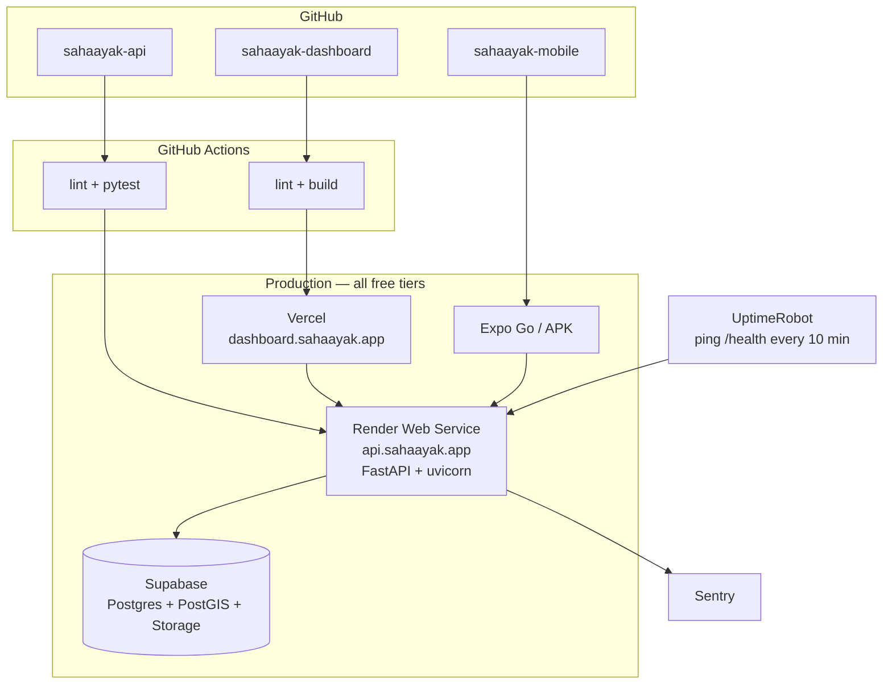

| Component | Service | Free tier | Deploy method |
|---|---|---|---|
| Dashboard | Vercel | 100 GB/mo bandwidth | `git push` → auto build |
| API | Render Web Service | 512 MB RAM, sleeps at 15 min idle | Dockerfile or native Python |
| Database | Supabase | 500 MB, PostGIS enabled | Managed |
| File storage | Supabase Storage | 1 GB | Managed |
| Mobile | Expo Go + one prebuilt APK | Free | `expo start` / `eas build` |
| Uptime | UptimeRobot | 50 monitors | HTTP monitor on `/health` |
| Errors | Sentry | 5k events/mo | SDK |
| Domain | Vercel/Render subdomains, or a free `.tech`/`.me` student domain | Free | — |

## 18.2 Environments

| Env | Purpose | Data |
|---|---|---|
| Local | Development | Docker Compose: `postgis/postgis:15-3.3` |
| Staging *(optional)* | Integration | Second Supabase project |
| Production | Demo | Supabase + Render + Vercel |

**Local setup in three commands** — worth writing on day one so nobody loses half a day to environment problems:
```bash
docker compose up -d                 # postgis
alembic upgrade head                 # schema
python -m app.seed.generate_demo_data  # 40 workers, 8 months of bookings
```

## 18.3 Environment variables

```bash
# api
DATABASE_URL=postgresql+psycopg://...supabase.co:5432/postgres
JWT_SECRET_KEY=...
JWT_ALGORITHM=HS256
ACCESS_TOKEN_EXPIRE_MINUTES=15
REFRESH_TOKEN_EXPIRE_DAYS=7
SUPABASE_URL=...
SUPABASE_SERVICE_KEY=...
RAZORPAY_KEY_ID=rzp_test_...
RAZORPAY_KEY_SECRET=...
SMS_PROVIDER=mock          # mock | msg91
KYC_PROVIDER=mock          # mock | digilocker
INSURANCE_PROVIDER=mock    # mock | eshram
NOMINATIM_USER_AGENT=sahaayak-sih2026
CORS_ORIGINS=https://dashboard.sahaayak.app
SENTRY_DSN=...
ENVIRONMENT=production
```

The `*_PROVIDER=mock` pattern is the mechanism that makes "swap in the real integration" a config change. Point at these variables when a judge asks how production-ready the mocks are.

## 18.4 CI/CD

```yaml
# .github/workflows/api.yml
name: API CI/CD
on:
  push: { branches: [main, develop] }
  pull_request: { branches: [main] }
jobs:
  test:
    runs-on: ubuntu-latest
    services:
      postgres:
        image: postgis/postgis:15-3.3
        env: { POSTGRES_PASSWORD: postgres, POSTGRES_DB: test }
        options: >-
          --health-cmd pg_isready --health-interval 10s
          --health-timeout 5s --health-retries 5
        ports: ['5432:5432']
    steps:
      - uses: actions/checkout@v4
      - uses: actions/setup-python@v5
        with: { python-version: '3.11' }
      - run: pip install -r requirements.txt
      - run: ruff check app/
      - run: alembic upgrade head
      - run: pytest -q
  deploy:
    needs: test
    if: github.ref == 'refs/heads/main'
    runs-on: ubuntu-latest
    steps:
      - run: curl -X POST "${{ secrets.RENDER_DEPLOY_HOOK }}"
```

**Branch strategy:** `main` (deployed, protected) ← `develop` (integration) ← `feature/*`. PRs into `develop` need one review. No direct pushes to `main` — this rule alone prevents the classic hackathon disaster of someone breaking the demo build at 3 a.m.

## 18.5 Deployment evolution

| | Phase 2 | Phase 3 |
|---|---|---|
| API | Render Starter ×2 instances + load balancing | Container orchestration, autoscaling, multi-AZ |
| Database | Supabase Pro, connection pooling (PgBouncer) | Primary + read replicas, partitioned `bookings` |
| Cache | Redis (Upstash free → paid) | Redis cluster |
| Workers | Celery worker + beat | Distributed queue, DLQ, priority lanes |
| Storage | Supabase Pro + CDN | S3-compatible with lifecycle policies |
| Observability | Sentry + Better Stack logs | Prometheus + Grafana + OpenTelemetry tracing |
| Mobile | Play Store internal testing | Play Store production, staged rollout, OTA updates |
| Infra as code | Manual + documented | Terraform |
| DR | Daily automated backups | Point-in-time recovery, cross-region replicas |

---

# 19. TEAM DEVELOPMENT PLAN

## 19.1 Role allocation (6 members)

| # | Role | Owns | Primary deliverables |
|---|---|---|---|
| 1 | **Backend Lead / Architect** | FastAPI core, auth, bookings, matching | Project skeleton, JWT, RBAC, booking state machine, matching engine, deployment |
| 2 | **Backend Developer** | Catalog, payments, welfare, ratings, invoices, analytics endpoints | Razorpay integration, split logic, invoice PDF, dashboard aggregate APIs |
| 3 | **Mobile Developer 1** | Customer app | Onboarding, discovery, booking, tracking, payment, rating screens |
| 4 | **Mobile Developer 2** | Worker app + shared components | Registration, offers, active job, earnings, welfare screens; shared design system |
| 5 | **Frontend / Dashboard Developer** | Both web dashboards | Society and Federation dashboards, charts, maps, verification UI |
| 6 | **AI/ML + Data** | Models, seed data, analytics | Classifier, forecasting, staffing recommendation, demo data generator, AI dashboard panel |

**UI/UX is shared, not a separate role.** Member 4 owns the design system in Figma; members 3 and 5 consume it. A dedicated designer in a 6-person team is a luxury; a shared, enforced component library is a necessity.

**If the team is 5:** merge roles 1 and 2 into one backend owner and move analytics endpoints to member 6.

## 19.2 Development timeline (4 weeks + finale)

**Week 1 — Foundation** *(everyone unblocked by Wednesday)*
- Day 1–2: repo setup, Docker Postgres+PostGIS, Alembic baseline, full schema, seed script skeleton, Figma wireframes, API contract agreed and frozen
- Day 3–5: auth + RBAC working end-to-end; catalog endpoints; mobile navigation shell with i18n; dashboard shell with auth; classifier training data collected
- **Week 1 gate: a user can log in on mobile and on the dashboard against the deployed API.** If this is not true by Sunday, cut scope immediately.

**Week 2 — Core journey**
- Worker registration + document upload + society verification flow (backend + mobile + dashboard)
- Booking creation, matching engine, offer dispatch, accept/reject
- Address picker with Leaflet
- Seed data generator producing 8 months of realistic bookings
- **Week 2 gate: a booking can be created and accepted by a worker.**

**Week 3 — Money, AI, dashboards**
- Payments, split calculation, invoice PDF, earnings, welfare ledger
- Rating flow
- Both dashboards fully populated
- All three models trained and exposed through `/ai/*`
- **Week 3 gate: the complete journey runs end to end on the deployed environment.**

**Week 4 — Polish and rehearsal**
- Full i18n pass in all three languages; layout check at 1.3× text scale
- Empty states, loading skeletons, error handling everywhere
- Bug fixing; performance check on the matching query
- Demo script written; **run the full demo end to end at least ten times**
- Backup: recorded demo video + offline APK + screenshots of every key screen

**Finale (36 h):** feature freeze at hour 24. Hours 24–30 polish and rehearse. Hours 30–36 rehearse only. Adding a feature after hour 24 is how teams lose.

## 19.3 Workflow rules

1. **The API contract is frozen at the end of Week 1.** Any change afterwards requires telling everyone in the group chat before merging. Mobile and dashboard work is blocked by contract churn more than by anything else.
2. **Generate the TypeScript client from OpenAPI** (`openapi-typescript-codegen`), never hand-write fetch calls. This eliminates the entire class of frontend/backend mismatch bugs.
3. **Mock-first frontends.** Mobile and dashboard developers work against mocked responses matching the frozen contract from day one; they never wait for the backend.
4. **Daily 15-minute standup:** what I finished, what I am doing, what is blocking me. Nothing else.
5. **Feature branches with small PRs.** One review before merging to `develop`. Never push to `main`.
6. **Integration day every Friday.** Everything merges to `develop` and the full journey is tested end to end. A team that integrates once, at the end, does not have a working demo.
7. **A shared bug board** (GitHub Projects, free) with three columns: Blocker / Should Fix / Nice To Have. Only Blockers get fixed in the final week.

## 19.4 Integration strategy

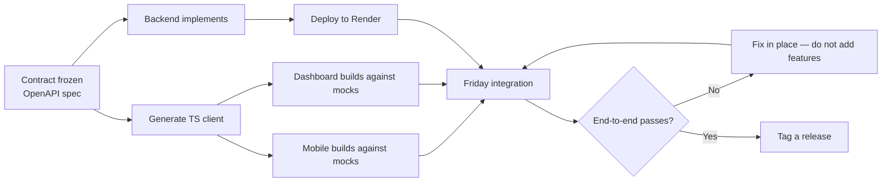

---

# 20. HACKATHON MVP PLAN

## 20.1 MUST BUILD NOW — non-negotiable

These constitute the demo. If any one of them is missing, the story breaks.

- [ ] Auth: phone + mock OTP, JWT, 5 roles, role-based routing
- [ ] Database schema + Alembic migrations + PostGIS enabled
- [ ] Seed data: 1 federation, 3 societies, 40 workers, 8 months of bookings
- [ ] Service catalogue with per-society rate cards
- [ ] Worker registration with document upload
- [ ] Society verification queue with approve/reject and badge issuance
- [ ] Customer address picker on a map
- [ ] Scheduled booking with slot selection
- [ ] **Emergency booking with parallel dispatch**
- [ ] **PostGIS radius matching + fair-match ranking with stored score breakdown**
- [ ] Offer dispatch with timer, accept/reject, first-accept-wins
- [ ] Booking state machine with status history
- [ ] Start-OTP verification
- [ ] Razorpay test payment, capture, verification
- [ ] **Automatic split: worker / society / welfare / platform, visible to both sides**
- [ ] Welfare ledger accumulating per job
- [ ] Rating and review
- [ ] Worker earnings screen
- [ ] Society dashboard: verification, workers, rates, bookings, analytics
- [ ] Federation dashboard: overview, heatmap, **AI panel**
- [ ] **AI: demand forecast + staffing recommendation + training priorities**
- [ ] 3-language support across both apps
- [ ] Deployed and publicly reachable
- [ ] Demo script rehearsed

## 20.2 SHOULD BUILD IF TIME PERMITS

- [ ] AI request classifier (text → service) — high demo value, roughly one day
- [ ] Invoice PDF generation and download
- [ ] Push notifications via Expo
- [ ] Demand heatmap on the federation map
- [ ] Worker skill certificates with an upload preview
- [ ] Booking cancellation with a reason
- [ ] Society-side manual allocation for unfulfilled bookings
- [ ] Insurance status card on the worker app
- [ ] Model accuracy (MAPE) shown next to the forecast chart

## 20.3 CAN MOCK FOR THE DEMO

| Mock | Implementation | What to say on stage |
|---|---|---|
| SMS OTP | Fixed code, displayed on screen in dev mode | "A live SMS gateway is a config change — the flow is complete" |
| DigiLocker eKYC | Screen returning a stubbed verified response | "The adapter interface is built; production onboarding is a policy step" |
| Payment settlement | Razorpay **test mode**; split computed and recorded | "This is the real Razorpay checkout in test mode" |
| e-Shram / insurance | Mock connector writing a real policy record | "The welfare ledger is real; only the government API call is stubbed" |
| Worker GPS movement | Simulated position updates | "Simulated so the demo does not depend on someone walking around the venue" |
| Booking history | Synthetic, seasonally realistic | "Synthetic history — but the forecast is genuinely computed from it, and I can retrain it right now" |

## 20.4 EXPLICITLY PHASE 2 — do not start these

Real SMS · DigiLocker · live settlement and payouts · recurring bookings · grievance workflow · road-distance ETA · availability calendar · LightGBM forecasting · sentiment analysis · Bhashini voice · WhatsApp/IVR · Celery/Redis · real-time tracking · bulk import · report export.

## 20.5 EXPLICITLY PHASE 3

Multi-tenancy · service extraction · OR-Tools optimisation · MLOps · dynamic pricing · ONDC · institution accounts · training marketplace · worker credit · fraud detection · full observability · 22 languages.

## 20.6 Risk register

| Risk | Likelihood | Impact | Mitigation |
|---|---|---|---|
| Render cold start kills the live demo | High | Critical | UptimeRobot from day one; warm the API 10 min before; local fallback ready |
| Venue Wi-Fi fails | Medium | Critical | Mobile hotspot; recorded video backup; local docker-compose stack on a laptop |
| Razorpay test checkout fails on stage | Medium | High | A `MOCK_PAYMENT=true` flag that skips the gateway and completes the flow |
| Scope creep in week 3 | High | High | Hard feature freeze; the bug board's Blocker column is the only work allowed |
| Integration breaks late | Medium | High | Friday integration days; frozen contract; generated client |
| Supabase free DB pauses | Low | High | Log in weekly; keep a `pg_dump` and a restore script ready |
| A key member is unavailable | Medium | Medium | No single-owner modules — every module has a documented second reader |
| Judges ask "how is this different from Urban Company?" | Certain | High | Rehearse the answer: ownership, floor wage, fairness ranking, welfare in the split |

---

# 21. SIH DEMO STRATEGY

## 21.1 The narrative

Judges remember a story about a person, not a tour of features. Build the demo around **Ramesh, an electrician who is idle 15 days a month**, and end on the Federation dashboard that decides where to train the next 50 workers. The product features appear as consequences of that story rather than as a checklist.

## 21.2 The 8-minute script

| Time | Scene | Screens | The line that matters |
|---|---|---|---|
| 0:00–0:45 | **The problem** | One slide: cooperative worker idle 15 days/month; private platform takes 25–30% | "The workers exist. The skills exist. The software doesn't." |
| 0:45–1:30 | **Worker onboarding** | Worker app registration → Society dashboard verification queue → approve → badge appears | "Verification isn't an algorithm guessing. It's his own cooperative society, which has known him for eleven years." |
| 1:30–2:15 | **Customer discovers** | Customer app in **Hindi**; type "पंखा नहीं चल रहा" → AI suggests Fan Repair | "Meena doesn't navigate menus. She describes the problem, in her language." |
| 2:15–3:15 | **Emergency booking** | Tap SOS → map pin → 5 workers found in 15 km → offers dispatched → **Ramesh's phone buzzes on stage** → accepts | "Twenty-two seconds, from request to a verified worker on the way." |
| 3:15–4:00 | **Fair matching, exposed** | Society dashboard → open the booking → **show the score breakdown JSONB** | "Ramesh wasn't picked because he's the highest rated. He was picked partly *because he had fewer jobs this week*. Fairness is a number in our ranking function, and we can show you the number." |
| 4:00–4:45 | **Service and payment** | Start-OTP → complete → Razorpay UPI → success | "The OTP means nobody can mark a job started that never happened." |
| 4:45–5:30 | **The split** | Split visualisation on the customer screen, then the worker's earnings screen | "₹800 paid. ₹688 to Ramesh. ₹80 to his own society. ₹24 into his insurance fund — automatically, from every single job. On a private platform, that ₹80 leaves the district and the ₹24 doesn't exist." |
| 5:30–6:30 | **Federation intelligence** | Federation dashboard → heatmap → **7-day forecast with confidence band** → staffing gap table → training priorities | "Next week Shimla needs 7 plumbers and has 4. And elder care has a shortage of 3 — so that's where NCCT should run the next training batch. This is a live model, and I can retrain it right now." |
| 6:30–7:15 | **Scale and roadmap** | Architecture slide + phase roadmap | "One federation today. The schema, the API and the auth are already multi-tenant. Nothing here needs a rewrite to serve twenty-five states." |
| 7:15–8:00 | **Close** | Impact slide | "Sahaayak doesn't build a new workforce. It gives the one the cooperative movement already has the software that private platforms used to take it away." |

## 21.3 PS feature coverage — have this table ready

| PS Expected Feature | Where it is demonstrated |
|---|---|
| Service provider registration and verification | 0:45–1:30 |
| Worker skill profiling and certification | Worker profile + society certification badge |
| Customer booking and scheduling | Scheduled booking flow (show briefly) |
| Geo-location based service matching | 2:15–3:15, PostGIS radius search |
| Digital payments and invoicing | 4:00–5:30, Razorpay + PDF invoice |
| Rating and feedback | Post-completion rating screen |
| Worker welfare and insurance integration | 4:45–5:30, welfare ledger + policy card |
| Emergency and on-demand booking | 2:15–3:15, SOS flow |
| Cooperative federation administration dashboard | 5:30–6:30 |
| Multilingual mobile application | 1:30 onward, entire demo in Hindi |
| AI-based demand forecasting and workforce allocation | 5:30–6:30 + score breakdown at 3:15 |

## 21.4 Demo rules

1. **Two phones on stage.** One customer, one worker. The worker's phone buzzing live in front of judges is the single most convincing moment available to you — do not replace it with a screen recording.
2. **Run in Hindi.** Switching to English only when a judge asks makes multilingual support real rather than claimed.
3. **Pre-warm everything** 10 minutes before: API, both dashboards, both apps logged in, seed data verified.
4. **Never say "this is just a prototype."** Say what is real and what is a mock adapter, precisely.
5. **Have the retrain command ready in a terminal.** When someone asks whether the AI is real, run it. Ten seconds of live training ends the question.
6. **Backups:** recorded full-run video, offline APK, screenshots of every key screen, and a local docker-compose stack on a laptop.

## 21.5 Anticipated questions

| Question | Answer |
|---|---|
| "How is this different from Urban Company?" | Ownership, floor wage, fairness in the ranking function, and welfare inside the payment split. Show the score breakdown and the split card — do not just assert it. |
| "Is the AI real or hardcoded?" | Retrain it live. Show the MAPE. |
| "Will cooperative workers actually use this?" | 18sp text, icon+text labels, Hindi-first, WhatsApp/IVR on the Phase 2 roadmap for feature phones. |
| "Can this handle a whole state?" | Stateless API, indexed geo queries, aggregate tables for analytics, multi-tenant schema. Show the Phase 3 column of the architecture table. |
| "What about payment settlement?" | Test mode today; Razorpay Route in Phase 2; the split is already computed and stored per transaction. |
| "Who pays for it?" | The society commission, set by the society — typically far below private-platform take rates, and it stays in the district. |
| "What if no worker accepts?" | Expanding radius, then automatic escalation to the Society Admin for manual allocation. Show the `UNFULFILLED` path. |
| "How do you prevent fake verification?" | Society accountability plus an immutable audit trail; DigiLocker eKYC in Phase 2. |

---

# 22. FINAL ARCHITECTURE DECISION

## 22.1 Architecture

> **A modular monolith FastAPI backend, one React Native (Expo) app serving both customer and worker roles, one React + Vite web app serving both admin dashboards, on a single PostgreSQL + PostGIS database, with scikit-learn/statsmodels models running in-process, and every external provider behind a swappable adapter.**

The four rules that make this scale without a rewrite:
1. Modules own their tables; cross-module access happens only through service functions.
2. Routers never touch the database.
3. External providers always sit behind an interface with a mock implementation.
4. The schema and API are versioned from commit one.

## 22.2 The stack — final

```
MOBILE       React Native + Expo SDK 51 · TypeScript · expo-router
             Zustand · TanStack Query · i18next · react-native-maps

WEB          React 18 · Vite · TypeScript · TailwindCSS · shadcn/ui
             Recharts · Leaflet · TanStack Query · i18next

BACKEND      FastAPI · Python 3.11 · Pydantic v2 · SQLAlchemy 2.0
             GeoAlchemy2 · Alembic · python-jose · passlib[argon2] · slowapi

DATABASE     PostgreSQL 15 + PostGIS  (Supabase free tier)
STORAGE      Supabase Storage (private buckets, signed URLs)

AI/ML        scikit-learn · statsmodels · pandas · numpy · joblib

PAYMENTS     Razorpay Test Mode (behind PaymentProvider)
MAPS         OpenStreetMap · Leaflet · Nominatim · PostGIS distance
PDF          WeasyPrint
PUSH         Expo Push Notifications

DEPLOY       Vercel (web) · Render (API) · Supabase (data)
             GitHub Actions (CI/CD) · UptimeRobot (keep-alive) · Sentry (errors)

TOTAL COST   ₹0
```

## 22.3 Development approach

1. **Week 1 is the schema and the contract.** Get the database and the OpenAPI spec right and frozen; everything else parallelises off them.
2. **Build the vertical slice first.** One service, one worker, one booking, end to end, before building breadth. A working narrow path beats four half-finished features.
3. **Mock-first on the frontend.** Nobody waits for the backend.
4. **Deploy in week 1, not week 4.** A project that first deploys in the final week does not demo.
5. **Freeze features at hour 24 of the finale.** Polish and rehearsal win hackathons; a rushed extra feature loses them.
6. **Rehearse the demo ten times.** The tenth run is where you find the bug that would have happened on stage.

## 22.4 The three things that must be excellent

Everything above is scaffolding for these. If time runs short, protect them at the cost of anything else:

1. **The emergency booking flow** — request to acceptance, live, on two phones, in under 30 seconds.
2. **The payment split card** — the single screen that makes the cooperative model visible and unarguable.
3. **The Federation AI panel** — forecast, staffing gap, training priorities; the screen that turns a services app into cooperative infrastructure the Ministry can act on.

## 22.5 Build order (start here on day one)

```
1.  Repo + Docker Postgres/PostGIS + Alembic baseline
2.  Full schema migration + seed data generator
3.  Auth: register, OTP (mock), JWT, roles, permission dependency
4.  Catalog: categories, services, society rate cards
5.  Workers: registration, documents, skills
6.  Society verification: queue, approve/reject, badge
7.  Addresses with map pin
8.  Bookings: create, state machine, status history
9.  Matching: PostGIS query + fair-ranking scorer
10. Offers: dispatch, timer, accept/reject, assign
11. Job lifecycle: en route, arrive, start-OTP, complete
12. Payments: order, verify, split, welfare contribution
13. Invoice PDF
14. Ratings
15. Worker earnings + welfare screens
16. Society dashboard
17. Federation dashboard
18. AI: forecast → staffing → training priorities
19. AI: request classifier
20. i18n pass, polish, empty states, error handling
21. Deploy, rehearse, back up
```

Steps 1–12 are the product. Steps 13–21 are what wins the round.

---

*End of document — Sahaayak PRD & Technical Architecture v1.0*
